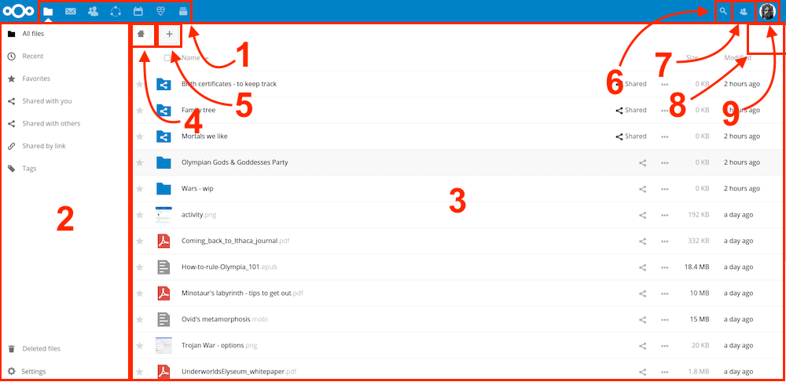

=================
Nextcloud Web界面
=================

您可以使用任何浏览器连接到您的Nextcloud服务器；只需要输入您的Nextcloud服务器地址、用户名和密码。支持以下浏览器：

* **Mozilla Firefox** 14以上版本
* **Google Chrome/Chromium** 18以上版本
* **Safari** 7以上版本
* **Internet Explorer** 11以上版本
* **Microsoft Edge**

  .. figure:: images/login_page.png
     :alt: Nextcloud登陆屏幕。

浏览主用户界面
------------

默认情况下，Nextcloud Web界面将打开到“文件”页面。 您可以添加，删除和共享文件，变更基于您设置的访问权限（如果您正在管理服务器）或服务器管理员的设置。

     :alt: 文件应用主视图。

Nextcloud用户界面包括以下区域和功能:

* **应用程序选择菜单** 区域(1): 您可以在左上角找到您的Nextcloud实例上可用的所有应用程序。 点击应用程序图标会将应用程序。

* **应用程序信息** 区域(2): 位于左侧栏中，提供与所选应用相关联的过滤器和任务。 例如，当您使用“文件”应用程序时，您可以使用一组特殊的过滤器快速查找文件，例如与您共享的文件，以及与其他人共享的文件。 您会在其他应用程序看到不同的项目。

* **应用程序视图** 区域(3): Nextcloud用户界面中的主要中心区域。 此区域显示所选应用的内容或用户功能。

* **导航栏** 区域(4): 位于主查看窗口（应用程序视图）的上方，此栏提供了一种浏览路径纪录，使您可以将文件夹层次结构切换到更高级别，最高移动到根级别（home）。

* **新建**按钮 区域(5): 位于导航栏，您可以通过新建按钮创建新文件、新文件夹或者删除文件。

.. 提示:: 您也可以从文件管理器中拖拽文件到Nextcloud文件应用程序视图里来上传文件。当前只有Chrome和Chromium支持文件夹拖拽。

* **搜索** 区域(6): 点击右上角的放大镜搜索文件。

* **联系人菜单** 区域(7): 给您服务器上联系人和用户的预览。 根据给定的详细信息和可用的应用程序，您可以直接与他们开始视频通话或发送电子邮件.

* **相册** 按钮 区域(8). 看起来像四方形，带您直接转到图片相册。

* **个人设置** 菜单 区域(9): 点击位于“搜索”字段右侧的齿轮图标或您的个人资料图片，打开“个人设置”下拉菜单。 您的个人页面提供以下设置和功能：

  * 链接下载桌面和移动应用程序
  * 再次显示首次运行向导
  * 服务器使用和空间可用性
  * 密码管理
  * 姓名、电子邮件和个人资料图片设置
  * 管理连接的浏览器和设备
  * 群组成员
  * 界面语言设置
  * 管理动态通知
  * 联合云ID和社交网络按钮
  * 用于外部存储的SSL证书管理
  * SSL certificate manager for external storages
  * 您的双重 认证设置
  * Nextcloud版本信息

查看 :doc:`设置您的使用偏好`部分来了解更多设置选项。
