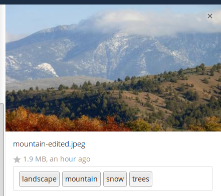
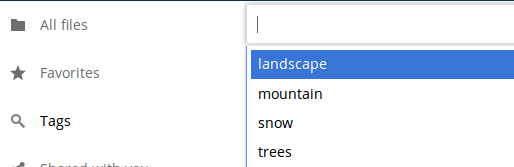
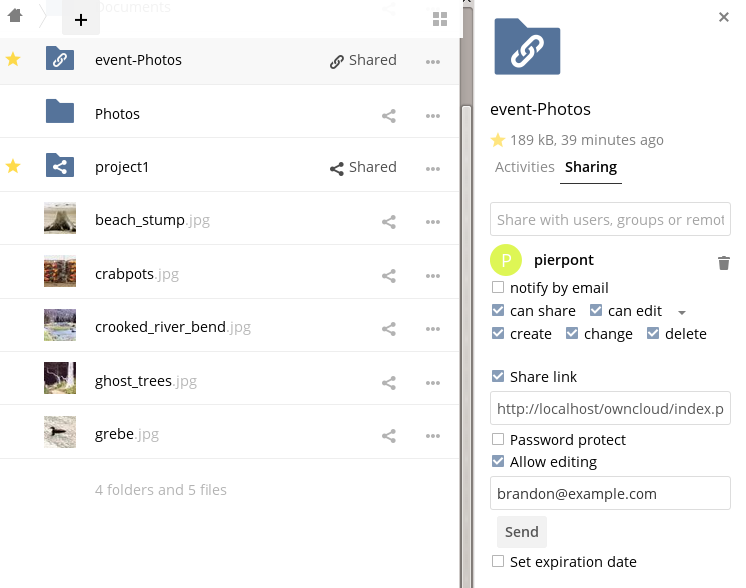
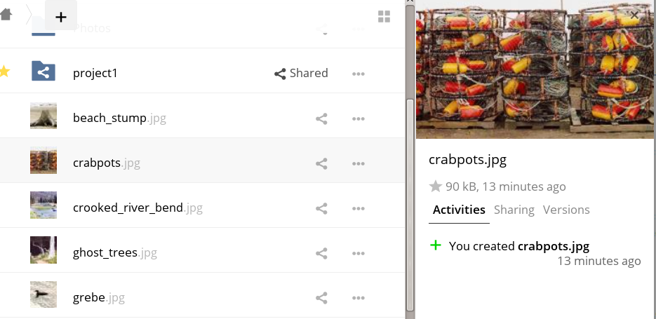
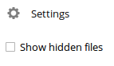

=============================================
Dateizugriff mit der Nextcloud Web-Oberfläche
=============================================

Sie können über die Nextcloud Web-Oberfläche Dateien erstellen, bestehende
Dateien bearbeiten, löschen, freigegeben oder bereits geteilte Inhalte
weiterleiten. Ihr Nextcloud-Administrator hat die Möglichkeit, diese
Funktionen zu deaktivieren. Wenn Funktionen bei Ihnen fehlen sollten, sollten
Sie Ihren Administrator kontaktieren.

.. figure:: ../images/files_page.png
   :alt: Die Dateiansicht.

Dateien mit Tags markieren
--------------------------

Dateien können mit Tags markiert werden. Um Tags zu setzen, wird zunächst die
Detailansicht geöffnet. Nach einem Mausklick auf Tags öffnet sich ein Eingabefeld,
auf dem ein oder mehrere Markierungen gesetzt werden. Alle Tags sind nach Eingabe
systemweit verfügbar und von allen Benutzern in Ihrer Nextcloud abrufbar.

Um Dateien nach Tags zu filtern, wird die "Tags"-App auf der linken Seitenleiste
verwendet.

Kommentare
----------

In der Detailansicht können Kommentare zu beliebigen Dateien oder Ordnern
hinzugefügt und gelesen werden. Die Kommentare sind für jeden sichtbar, der
auch Zugriff auf die Datei hat.

.. figure:: ../images/file_menu_comments_2.png
   :alt: Erstellen und Anzeigen von Kommentaren.

Video Player
------------

Videos können in Nextcloud mit der "Video Player"-App wiedergegeben werden. Hierzu
genügt ein Klicken auf die Video-Datei. Das Abspielen von Videos mit dem nativen
Nextcloud "Video Player"-App hängt vom Browser des Benutzer, sowie vom
Video-Dateiformat ab. Ist das Video-Streaming durch Ihren Nextcloud-Administrator
aktiviert, aber Videos nicht abgespielt werden können, kann es sich um ein
Browser-Problem handeln. Siehe https://developer.mozilla.org/en-US/docs/Web/HTML/Supported_media_formats#Browser_compatibility
für unterstützte Multimediaformate in Web-Browser.

.. figure:: ../images/video_player_2.png
   :alt: Ein Video ansehen.

Dateiverwaltung
---------------

Nextcloud kann Miniaturansichten für Bilddateien, MP3-Cover und Textdateien
anzeigen, sofern diese Funktion von Ihrem Nextcloud-Administrator aktiviert
wurde. Bewegen Sie den Mauszeiger über eine Datei oder einen Ordner, um die
Steuerelemente für die folgenden Operationen anzuzeigen:

Favorit
  Mit einem Klick auf den Stern, werden Inhalte als Favorit markiert. Um
  markierte Favoriten schnell zu finden, wird die "Favoriten"-App auf
  der linken Seitenleiste angeklickt.

.. figure:: ../images/files_page-1.png
   :alt: Dateien als Favorit markieren.

Teilen
  Es können Dateien oder Ordner mit einer Gruppe und anderen Benutzern geteilt
  werden. Um Inhalte öffentlich zu teilen, müssen Freigaben über URLs erstellt
  werden. Freigegebene Inhalte sind an den Symbolen zu erkennen, aber auch mit
  wem diese geteilt wurden. Um die Freigabe aufzuheben genügt ein Mausklick auf
  das Papierkorb-Symbol.

.. note:: Seit Version 9.0, können alle wiederholt geteilte Inhalte der
   ursprünglichen Dateifreigabe eingesehen werden.

  Wenn die automatische Wortvervollständigung des Benutzernamen aktiviert ist,
  wird mit der Eingabe eines Benutzernamens oder des Gruppennamens das Wort
  automatisch für Sie vervollständigt. Sind von Ihrem Administrator die E-Mail
  Benachrichtigungen aktiviert, können E-Mail Benachrichtigungen für die neue
  Freigabe über den Freigabe-Bildschirm gesendet werden.

Es gibt fünf Freigabeberechtigungen:

* Kann weiterteilen; ermöglicht dem Benutzer oder der Gruppe, geteilte Inhalte
  erneut zu teilen.
* Kann bearbeiten; ermöglicht dem Benutzer oder der Gruppe, Ihre Dateien oder
  gemeinsamen Inhalte mit der Dokumenten-App zu bearbeiten.
* Kann erstellen; ermöglicht dem Benutzer oder der Gruppe, neue Dateien zu erstellen und diese der Freigabe hinzuzufügen.
* Kann ändern; ermöglicht dem Benutzer oder der Gruppe, eine neue Version einer freigegebenen Datei hochzuladen und zu ersetzen.
* Kann löschen; ermöglicht dem Benutzer oder der Gruppe, geteilte Dateien zu löschen.

Überlaufmenü
  Das Überlaufmenü (drei Punkte), zeigt Details an und erlaubt Ihnen, Dateien
  umzubenennen, herunterzuladen und zu löschen.

.. figure:: ../images/files_page-3.png
   :alt: Überlaufmenü.

   Die Detailansicht zeigt Aktivitäten-, Freigabe- und Versionsinformationen an.

Das Symbol **Einstellungszahnrad** unten links erlaubt, versteckte Dateien in der
Nextcloud Web-Oberfläche anzuzeigen oder zu verstecken. Diese werden auch als
Punkt-Dateien bezeichnet, da sie mit einem Punkt vorangestellt sind, z.B. ``.mailfile``.
Der Punkt teilt dem Betriebssystem mit, dass diese Dateien in Ihren Dateibrowsern
ausgeblendet werden sollen – es sei denn, dass diese Dateien explizit angezeigt
werden sollen. Diese Konfigurationsdateien, können ausgeblendet werden.

Dateivorschau
-------------

Indem auf den Dateinamen geklickt wird, können unkomprimierte Textdateien,
OpenDocument-Dateien, Videos und Bilddateien in der Nextcloud integrierten
Dateivorschau angezeigt werden. Möglicherweise gibt es andere Dateitypen, die
angezeigt werden können, wenn Ihr Nextcloud-Administrator sie aktiviert hat.
Wenn Nextcloud keine Datei im Vorschaumodus anzeigen kann, wird diese Datei
heruntergeladen.

Durch Nextcloud navigieren
--------------------------

Navigieren durch Ordner in Nextcloud ist so einfach wie das Klicken auf einen
Ordner. Um eine Ebene zurückzukehren, kann die Zurück-Taste vom Browser benutzt
werden. Für eine schnelle Navigation befindet sich am oberen Rand eine klickbare
Navigationsleiste, die den Dateipfad anzeigt.

Statussymbole für die Freigabe
------------------------------

Jeder freigegebene Ordner ist mit dem Symbol ``Geteilt`` markiert. Öffentliche
Freigaben sind mit einem Kettenglied-Symbol markiert. Nicht freigegebene Ordner
haben keine Markierungen.

.. figure:: ../images/files_page-5.png
   :alt: Statussymbole für die Freigabe.

Erstellen und Hochladen von Dateien und Ordnern
-----------------------------------------------

In einen Nextcloud-Ordner können Dateien und Ordner erstellt oder hochgeladen
werden. Hierfür wird das *Neu*-Symbol, dargestellt durch ein Pluszeichen,
neben dem Dateipfad verwendet.

.. figure:: ../images/files_page-6.png
   :alt: Neu Datei/Ordner/Hochladen Menü.

Die Schaltfläche *Neu* bietet folgende Optionen:

Pfeil nach oben
  Bedeutet Dateien von Ihrem Computer in die Nextcloud hochladen. Dateien können
  auch per Drag & Drop hochgeladen werden.

Textdatei
  Erstellt eine neue Textdatei und fügt die Datei zum aktuellen Ordner hinzu.

Ordner
  Erstellt einen neuen Ordner im aktuellen Ordner.

Dateien und Ordner auswählen
----------------------------

Es können eine oder mehrere Dateien oder Ordner ausgewählt werden, indem auf die
entsprechende Kontrollkästchen geklickt wird. Um alle Dateien im aktuellen
Ordner auszuwählen, wird auf das obere Kontrollkästchen an der Dateiliste
geklickt.

Wenn Sie mehrere Dateien selektieren, können Sie die Auswahl löschen oder als
ZIP-Datei herunterladen. Mit der Auswahl erscheint oben die Schaltflächen
``Löschen`` und ``Herunterladen``, die entsprechend angewendet werden kann.

.. note:: Wenn die Schaltfläche ``Herunterladen`` nicht sichtbar ist, hat der
   Administrator diese Funktion deaktiviert.

Filtern der Dateiansicht
------------------------

Die linke Seitenleiste enthält mehrere Filter zum schnellen Sortieren und
Verwalten Ihrer Dateien.

Alle Dateien
  Die Standardansicht; Zeigt alle Dateien an, auf die zugegriffen werden kann.

Favoriten
  Dateien oder Ordner, die mit dem gelben Stern markiert sind.

Mit Ihnen geteilt
  Zeigt alle Dateien an, die von anderen Benutzern oder Gruppen mit Ihnen
  geteilt wurden.

Von Ihnen geteilt
  Zeigt alle Dateien an, die Sie mit anderen Benutzern oder Gruppen teilen.

Geteilt über einen Link
  Zeigt alle Dateien an, die von Ihnen öffentlich geteilt werden.

Externer Speicher (optional)
  Zeigt alle Dateien an, auf die Sie Zugriff von z.B. von externen Speichergeräte
  und Diensten wie Dropbox, Google und Amazon S3 haben.

Verschieben von Dateien
-----------------------

Sie können Dateien und Ordner verschieben, indem sie per Drag & Drop in einen
anderen Ordner gezogen werden.

Ändern des Ablaufdatum
----------------------

In älteren Versionen von Nextcloud kann ein Ablaufdatum für lokale und
öffentliche Freigaben festgelegt werden. In den neuen Versionen kann das
Ablaufdatum nur noch auf öffentliche Freigaben gesetzt werden, somit bleiben
die lokalen Freigaben bestehen. Um lokale Freigaben aufzuheben muss das
nebenstehende Papierkorb-Symbol angeklickt werden.

Erstellen oder Verbinden mit einer Federated Link-Freigabe
----------------------------------------------------------

Mithilfe von Federated Cloud Freigaben können Dateifreigaben von entfernten
Nextcloud-Servern hinzugefügt und diese wie eine lokale Freigabe verwaltet
werden. Ab Nextcloud 9 ist die Einbindung in ein Verbund mit neuen
Freigabeverbindungen einfacher und effizienter. Siehe
:doc:`federated_cloud_sharing` für den Umgang mit Federated Cloud Freigaben.
