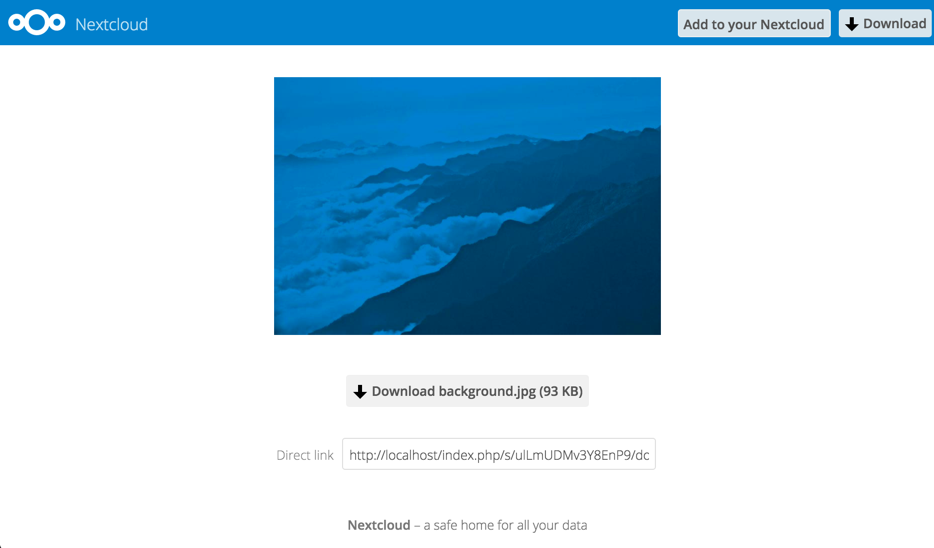

=================
Federated-Sharing
=================

Die Federated Freigabe ermöglicht Ihnen das Einbinden von Dateifragaben von
entfernten Nextcloud-Servern. Sie können demnach direkte Freigabe-Links mit
Benutzern auf anderen Nextcloud-Servern erstellen.

Eine neue Federated Freigabe erstellen
--------------------------------------

Die Federated Freigabe wird standardmäßig bei neuen oder aktualisierten
Nextcloud-Installationen aktiviert. Gehen Sie folgendermaßen vor, um eine neue
Freigabe mit anderen Nextcloud-Servern oder ownCloud-Servern ab Version 9 zu
erstellen:

1. Gehen Sie in der linken Seitenleiste auf ``Alle Dateien`` und klicken Sie
auf das Symbol "Freigeben" neben der Datei oder dem Ordner, den Sie freigeben
möchten. Geben Sie in der rechten Seitenleiste den Benutzernamen und die URL des
entfernten Benutzers wie folgt an: ``<username>@<oc-server-url>``. In diesem
Beispiel lautet die Eingabe: ``layla@remote-server/nextcloud``. Das Formular
erkennt automatisch die Adresse und markiert diese als "entfernt" Freigabe.
Um die Adresse hinzuzufügen kann die Eingabetaste verwendet, oder auf die
Auswahl geklickt werden.

.. figure:: ../images/direct-share-1.png

2. Wenn Ihr lokaler Nextcloud-Server eine erfolgreiche Verbindung mit dem
entfernten Nextcloud-Server herstellt hat, sehen Sie eine Bestätigung. Die
einzige Freigabeberechtigung ist **Kann bearbeiten**.

Unter dem Menüpunkt "Teilen" können die Freigaben der Datei eingesehen werden.
Die Freigabe kann jederzeit durch ein Klick auf das Papierkorb-Symbol
aufgehoben werden. Dies löscht nur die Freigabe und nicht die Datei.

Erstellen einer neuen Federated Freigabe per E-Mail
---------------------------------------------------

Verwenden Sie diese Methode, wenn Sie mit Benutzern auf ownCloud 8.x und älter
Dateien teilen möchten.

Was, wenn Benutzername oder die URL unbekannt ist? Dann kann Nextcloud
den Link erstellen und Ihrem Empfänger zusenden.

.. figure:: ../images/create_public_share-6.png

Wenn der Empfänger die E-Mail erhält, müssen Sie eine Reihe von Schritten
durchführen, um die Freigabe per Link abzuschließen. Zuerst müssen Sie den Link
öffnen, der per Web-Browser versendet wurde. Klicken Sie dann auf die
Schaltfläche **Zu Ihrer Nextcloud hinzufügen**.

Die Schaltfläche **Zu Ihrer Nextcloud hinzufügen** ändert sich in ein
Formularfeld. Der Empfänger muss in diesem Feld die URL Ihres Nextcloud- oder
ownCloud-Servers eingeben und zum Bestätigen die Eingabetaste drücken oder auf
den Pfeil klicken.

.. figure:: ../images/create_public_share-9.png

Im nächsten Schritt muss das Hinzufügen im Dialog bestätigt werden. Mit einem
Klick auf **Hinzufügen von entfernter Freigabe** ist das Hinzufügen einer
neuen Federated Freigabe abgeschlossen.

Entfernen Sie Ihre Freigaben jederzeit mit einem Klick auf das Papierkorb-Symbol.
Dies entfernt lediglich die Freigabe, nicht aber die geteilten Dateien.
