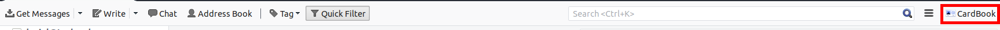
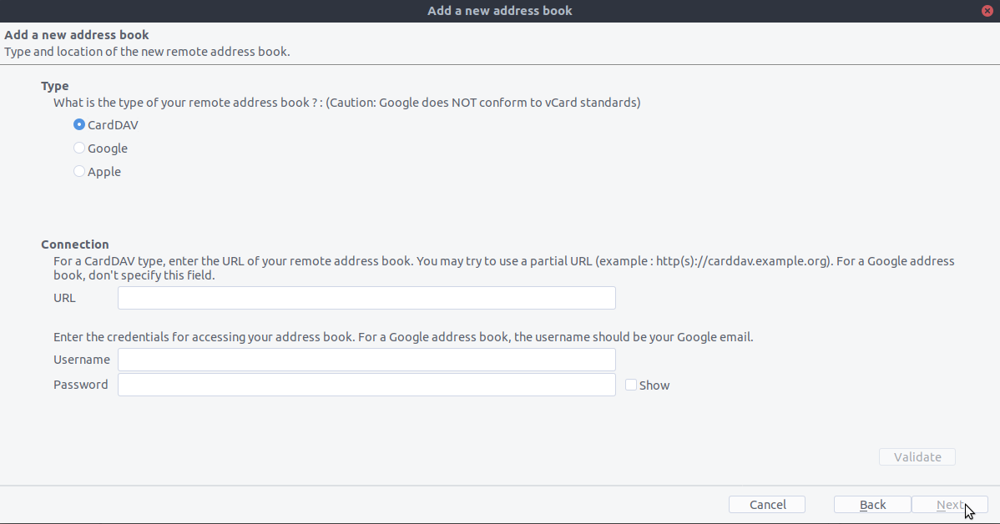

==============================
Synchronisation mit Thunderbird
==============================

`Thunderbird <https://www.thunderbird.net>`_ ist ein funktionsreiches und stabiles Mailprogrammm, das in einen vollwertigen PIM (persönlichen Informationsmanager) verwandelt werden kann. 
Jedoch hat es von Hause aus keine Unterstützung für die Synchronisation von Addressbüchern via CardDAV und beherrscht das automatische Entdecken von Adressbüchern und Kalendern auf dem Server nicht.
Daher werden zur Synchronisation mit Nextcloud verschiedene Erweiterungen benötigt.
 
Mit TBSync
----------

Für diese Methode müssen drei Erweiterungen installiert werden:

1. `Der Lightning-Kalender <https://addons.thunderbird.net/de/thunderbird/addon/lightning/>`_
2. `TBSync <https://addons.thunderbird.net/de/thunderbird/addon/tbsync/>`_ sowie 
3. Der `TBSync provider für CalDAV and CardDAV <https://addons.thunderbird.net/de/thunderbird/addon/dav-4-tbsync/>`_

Nach der Installation, wählen Sie auf Windows **Extras**/**Synchronisationseinstellungen (TBSync)**, unter Linux **Bearbeiten/Synchronisationseinstellungen (TBSync)**.

* Im Accountmanager wählen Sie "**Konto-Aktionen** / **Neues Konto hinzufügen** / **CardDAV & CalDAV**"
* Im nächsten Fenster, wählen Sie **Automatische Konfiguration** und klicken Sie auf **weiter**
* Füllen Sie die Felder **Kontoname** (frei wählbar), **Benutzername**, **Passwort** und **Serveradresse** aus und klicken Sie auf and click **weiter**
* Im nächsten Fenster zeigt TBSync die automatisch entdeckten CalDAV- und CardDAV-Adressen. Klicken sie auf **Fertigstellen**.
* Setzen Sie einen Haken bei **Konto aktivieren und synchronisieren**. TBSync entdeckt jetzt alle Adressbücher und Kalender zu denen Ihr Account auf dem Server Zugang hat.
* Setzen Sie einen Haken neben jedem Kalender und Adressbuch, das synchronisiert werden soll. Tragen Sie auch einen Wert bei **Periodische Synchronisation (in Minuten)** ein und klicken Sie den Kopf **jetzt synchronisieren**
* Wenn die erste Synchronisation erfolgreich beendet ist, können Sie das Fenster schließen. In Zukunft wird TBSync die Synchronisation im Hintergrund vornehmen. Falls Sie nicht ein funktionsreicheres Adressbuch benötigen, sind Sie jetzt fertig.

Alternative: Die Erweiterung CardBook (Nur Kontakte)
----------------------------------------------------
`CardBook <https://addons.thunderbird.net/de/thunderbird/addon/cardbook/>`_ ist eine fortgeschrittene Alternative zu Thunderbirds Adressbuch, das CardDAV direkt unterstützt. TBSync und CardBook können gleichzeitig installiert sein.
1. Das Symbol für Cardbook finden Sie oben rechts in Thunderbird:

2. Wenn Sie den Cardbook-Reiter geöffnet haben wählen Sie:

   -  "Adressbuch > Neues Adressbuch **Entfernt** > Weiter
   -  Tragen Sie Benutzername, Passwort und die Adresse Ihres Servers ein

3. Klicken Sie auf "Überprüfen", danach auf "weiter, danach wählen Sie alle Adressbücher, die synchronisiert werden sollen.

.. image:: ../../user_manual/images/addressbook_name.png
