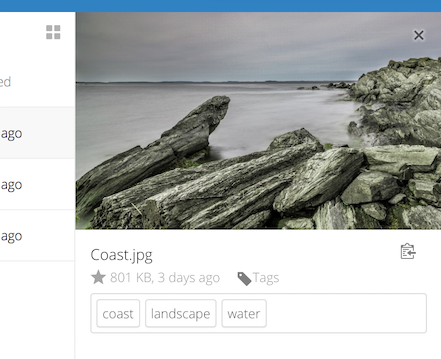

======================================================
Accéder à vos fichiers à l'aide de l'interface Web Nextcloud
=============================================== ====

Vous pouvez accéder à vos fichiers Nextcloud avec l’interface Web Nextcloud et créer,
prévisualiser, éditer, supprimer, partager et re-partager des fichiers. Votre administrateur Nextcloud
a la possibilité de désactiver ces fonctionnalités, donc si certaines d’entre elles sont manquantes sur votre
système demandez à votre administrateur de serveur.

.. figure:: ../images/users-files.png
   :alt: L'écran d'affichage des fichiers.

Balisage de fichiers
-------------

Vous pouvez attribuer des balises aux fichiers. Pour créer des balises, ouvrez un fichier dans la vue Détails.
Puis indiquez vostre balise. Pour entrer plusieurs balises, appuyez sur la touche Retour après avoir
créer chaque balise. Toutes les balises sont des balises système et sont partagées par tous les utilisateurs de votre
Serveur Nextcloud.

Then use the Tags filter on the left sidebar to filter files by tags.

.. figure:: ../images/files_page-8.png
   :alt: Voir les balises de fichiers.

commentaires
--------

Utilisez la vue Détails pour ajouter et lire des commentaires sur n’importe quel fichier ou dossier. commentaires
sont visibles pour tous ceux qui ont accès au fichier.

.. figure:: ../images/file_menu_comments_2.png
   :alt: Création et affichage de commentaires.

Lecteur vidéo
------------

Vous pouvez lire des vidéos dans Nextcloud avec l'application Video Player en cliquant simplement sur
le fichier. La diffusion vidéo par le lecteur vidéo natif Nextcloud dépend de votre navigateur Web
et le format vidéo. Si votre administrateur Nextcloud a activé la vidéo
en streaming, et si cela ne fonctionne pas dans votre navigateur Web, il se peut que cela soit un problème de navigateur. Voir https://developer.mozilla.org/en-US/docs/Web/HTML/Supported_media_formats#Browser_compatibility pour connaître les formats multimédias pris en charge dans les navigateurs Web.

.. figure:: ../images/video_player_2.png
   :alt: Regarder une vidéo.

Contrôles de fichiers
-------------

Nextcloud peut afficher des aperçus miniatures pour des fichiers image, des jaquettes MP3,
et les fichiers texte, si cela est activé par votre administrateur de serveur. Survolez votre curseur
sur un fichier ou un dossier pour exposer les contrôles des opérations suivantes:

Favoris
  Cliquez sur l'étoile à gauche de l'icône du fichier pour le marquer comme favori, puis
  retrouvez rapidement tous vos favoris avec le filtre Favoris sur la gauche
  barre latérale.

.. figure:: ../images/files_page-1.png
   :alt: Marquage des fichiers favoris.

Partager
  Partagez le fichier ou le dossier avec un groupe ou d’autres utilisateurs et créez un partage public
  avec hyperlien. Vous pouvez également voir avec qui vous avez déjà partagé,
  et révoquer des partages en cliquant sur l'icône de la corbeille.

.. note:: Depuis la version 9.0, vous pouvez voir tous les re-partages de vos partages de fichiers d'origine.

  Si le remplissage automatique des nom d'utilisateur 
  est activé, lorsque vous commencez à taper le nom de l'utilisateur ou du groupe, Nextcloud le
  complète automatiquement pour vous. Si votre administrateur a activé les notifications par 
  courrier électronique, vous pouvez envoyer une notification par e-mail du nouveau partage à partir de
  l'écran de partage.

.. figure:: ../images/files_page-2.png
   :alt: Partage de fichiers.

Vous disposez de cinq autorisations de partage:

* Peut partager; permet aux utilisateurs avec qui vous partagez de partager à nouveau.
* Peut éditer; permet aux utilisateurs avec lesquels vous partagez de modifier vos fichiers partagés et de collaborer à l'aide de l'application Documents.
* Créer; permet aux utilisateurs avec lesquels vous partagez de créer de nouveaux fichiers et de les ajouter au partage.
* Changement; permet de télécharger une nouvelle version d'un fichier partagé et de le remplacer.
* Effacer; permet aux utilisateurs avec lesquels vous partagez de supprimer des fichiers partagés.

Menu détail
  Le menu détail (trois points) affiche les détails du fichier et vous permet de
  renommer, télécharger ou supprimer des fichiers.

.. figure:: ../images/files_page-3.png
   :alt: Menu détail.

   La vue Détails affiche les informations sur les activités, le partage et les versions.

.. figure:: ../images/files_page-4.png
   :alt: Ecran détails .

L'icône d'engrenage ** Paramètres ** en bas à gauche vous permet d'afficher ou de masquer les fichiers masquées
dans votre interface Web Nextcloud. Ceux-ci sont également appelés fichiers de points, parce qu'
ils sont précédés d’un point, par exemple `` .mailfile``. Le point indique votre opération
système pour masquer ces fichiers dans vos navigateurs, sauf si vous choisissez de les afficher. 
Il s’agit généralement de fichiers de configuration, ce qui vous permet de réduire leur exposition.

.. figure:: ../images/hidden_files.png
   :alt: Masquer ou afficher des fichiers cachés.

Prévisualisation des fichiers
----------------

Vous pouvez afficher des fichiers texte non compressés, des fichiers OpenDocument, des vidéos et des images
dans les visualiseurs intégrés Nextcloud en cliquant sur le nom du fichier.
Vous pouvez prévisualiser d’autres types de fichiers si votre administrateur Nextcloud l'a autorisé.
Si Nextcloud ne peut pas afficher un fichier, il lance un processus de téléchargement et
télécharge le fichier sur votre ordinateur.

Naviguer dans votre Nextcloud
--------------------------------

Naviguer dans les dossiers de Nextcloud est aussi simple que de cliquer sur un dossier pour l'ouvrir
et utilisez le bouton retour de votre navigateur pour passer au niveau précédent.
Nextcloud fournit également une barre de navigation en haut du champ Fichiers pour une consultation rapide.

Partage des icônes d'état
--------------------

Tout dossier partagé est identifié par l'icône ``Partagé``.
Les partages de liens publics sont marqués d'un lien avec une chaîne. Les dossiers non partagés sont vides.

.. figure:: ../images/files_page-5.png
   :alt: Partage des icônes d'état.

Création ou téléchargement de fichiers et de répertoires
-------------------------------------------

Téléchargez ou créez de nouveaux fichiers ou dossiers directement dans un dossier Nextcloud en cliquant sur
sur le bouton * Nouveau * dans l'application Fichiers.

.. figure:: ../images/files_page-6.png
   :alt: Le nouveau fichier / dossier / menu de téléchargement.

Le bouton * Nouveau * fournit les options suivantes:

Flèche vers le haut
  Téléchargez des fichiers de votre ordinateur vers Nextcloud. Vous pouvez également télécharger des fichiers par
  glisser/déposer depuis votre gestionnaire de fichiers.

Fichier texte
  Crée un nouveau fichier texte et ajoute le fichier à votre dossier actuel.

Dossier
  Crée un nouveau dossier dans le dossier actuel.

Sélection de fichiers ou de dossiers
--------------------------

Vous pouvez sélectionner un ou plusieurs fichiers ou dossiers en cliquant sur leurs cases à cocher. Pour
sélectionner tous les fichiers du répertoire actuel, cochez la case située en haut de la liste des fichiers.

Lorsque vous sélectionnez plusieurs fichiers, vous pouvez tous les supprimer ou les télécharger en tant que fichier
ZIP en utilisant les boutons ``Supprimer`` ou ``Télécharger`` qui apparaissent en Haut.

.. note:: Si le bouton ``Télécharger`` n'est pas visible, l'administrateur a
   désactivé cette fonctionnalité.

Filtrer la vue des fichiers
------------------------

La barre latérale gauche de la page Fichiers contient plusieurs filtres pour un tri rapide
et gérer vos fichiers.

Tous les fichiers
  La vue par défaut; affiche tous les fichiers auxquels vous avez accès.

Favoris
  Fichiers ou dossiers marqués d'une étoile jaune.

Partagé avec vous
  Affiche tous les fichiers partagés avec vous par un autre utilisateur ou groupe.

Partagé avec d'autres
  Affiche tous les fichiers que vous avez partagés avec d'autres utilisateurs ou groupes.

Partagé par lien
  Affiche tous les fichiers que vous partagez via un lien public.

Stockage externe (facultatif)
  Les fichiers auxquels vous avez accès sur des périphériques de stockage externes et des services tels que
  Dropbox, Google et Amazon S3.

Déplacement de fichiers
------------

Vous pouvez déplacer des fichiers et des dossiers en les faisant glisser dans un répertoire.

Changement de date d'expiration de l'action
-------------------------------

Dans les anciennes versions de Nextcloud, vous pouviez définir une date d’expiration pour les partage locaux
et les partages publiques. Maintenant, vous ne pouvez définir une date d'expiration uniquement que sur les partages publique,
et les partages locaux n'expirent pas lorsque les partages publique expirent. Le seul moyen de faire
"Expirer" un partage local consiste à cliquer sur l'icône de la corbeille pour annuler le partage de vos fichiers.

Création ou connexion à un lien de partage de fédération
-------------------------------------------------

Federated Cloud Sharing vous permet de monter des partages de fichiers à partir d'un Nextcloud distant
et de les gérer comme un partage local. Dans Nextcloud |version|, le processus de
création d'un nouveau lien de partage est plus facile et plus simple. Voir
:doc:`federated_cloud_sharing` apprendre à créer et se connecter à de nouveaux
Partages Federated Cloud.
