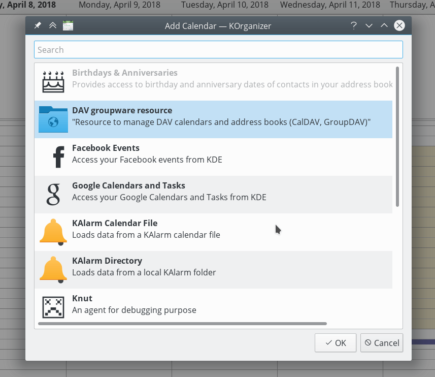
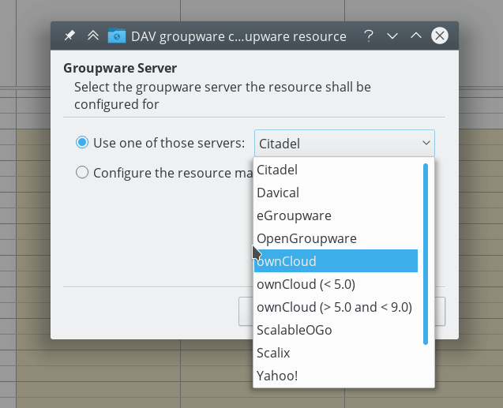

=======================================
Synchronisation avec KDE PIM
=======================================

KOrganizer et KAddressbook peuvent synchoniser les données avec le serveur Nextcloud.

On peut le faire en suivent ces différentes étapes :

1. Ouvrez Lorganizer et dans les liste des calendriers (en bas à gauche) faîtes un clik droit et choisissez ``Ajouter un calendrier``.

.. image:: ../images/KOrganizer_add_calendar.png

2. Dans les résultats des ressources disponibles, choisissez ``DAV groupware resource``.

3. Entrer votre nom d'utilisateur et votre mot de passe, ou, si vous avez activé l'authentification à double-facteur, utilisez un App Mot de passe. Ensuite, cliquez sur "suivant".

.. image:: ../images/korganizer_credentials.png

Pour créer un Application Mot de passe si vous avez activé l'authentification à double-facteurs :

    * dans Nextcloud, allez dans vos paramètres utilisateur et regarder dans l'onglet "Sécurité"
    * Recherchez le boutton ``create new App password`` et avant lui, entrer un nom unique d'identification comme ``KOrganizerLook sur mon bureau``.

    .. image:: ../images/app_password_naming.png

    * Ensuirte cliquez sur ``create new App password``. Copiez/collez le mot de passe.
    
.. image:: ../images/app_password_created.png

4. As Groupware Server, choose ownCloud or Nextcloud in the drop-down menu. Click next.

5. Enter your Nextcloud server url and, if needed, installation path (anything that comes after the first /, for example ``mynextcloud`` in ``https://exampe.com/mynextcloud``). Then click next.

.. image:: ../images/KOrganizer_server_address.png

6. Vous pouvez maintenant tester votrec connexion. Si cela ne fonctionne pas, vous pouvez revenir en arrière et essayer de résoudre le problème en changeant certains paramètres.

.. image:: ../images/KOrganizer_test1.png

.. image:: ../images/KOrganizer_test2.png

**Note:** the test can take a while!

7. Pick a name for this resource, for example ``work`` or ``private`` By default, both CalDav and CardDav are synced, that is, both calendar and contacts. Choose a refresh time, 5 minutes is default but quite often for use on a laptop. Perhaps you want to save power and be a bit slower, like once every 30 minutes. Note that you can update with a right-click on the item in the calendar list and when you create a new appointment it is synced to Nextcloud right away.

.. image:: ../images/KOrganizer_pick_resources.png

Terminé
~~~~

Après quelques seconde ou quelques minutes (le temps de la synchronisation peut s'avérer long avec une connexion lente) KOrganizer va vous montrer vos calendriers et KAddressBook vos contacts !

.. image:: ../images/KOrganizer.png
.. image:: ../images/KAddressBook.png
