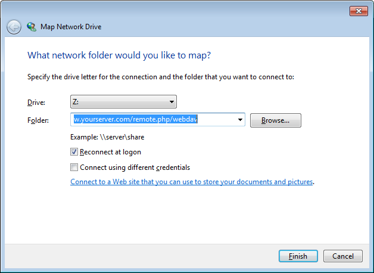

===============================================
Acessando arquivos do Nextcloud usando o WebDAV
===============================================

O Nextcloud suporta totalmente o protocolo WebDAV e você pode conectar e sincronizar
com seus arquivos Nextcloud através do WebDAV. Neste capítulo você aprenderá como
conectar o Linux, macOS, Windows e dispositivos móveis ao seu servidor Nextcloud via
WebDAV. Antes de entrarmos na configuração do WebDAV, vamos dar uma rápida olhada na
maneira recomendada de conectar dispositivos clientes aos seus servidores Nextcloud.

.. note:: Nos exemplos a seguir, você deve ajustar **example.com/** a
   URL da sua instalação do servidor Nextcloud. E USERNAME é o ID do usuário do
   usuário conectado.

   Veja o URL do webdav (canto inferior esquerdo, configurações) no seu Nextcloud.

Nextcloud Desktop e clientes móveis
------------------------------------

A maneira recomendada de sincronizar um PC de mesa com um servidor Nextcloud é
usando `Nextcloud / ownCloud sync clients <https://nextcloud.com/install/#install-clients>`_. Você pode configurar o
cliente para salvar arquivos em qualquer diretório local e você pode escolher qual
diretórios no servidor Nextcloud para sincronizar. O cliente exibe o
status atual da conexão e registra toda a atividade, então você sempre sabe qual
arquivos remotos foram baixados para o seu PC e você pode verificar que os arquivos
criados e atualizados no seu PC local estão devidamente sincronizados com o servidor.

A maneira recomendada de sincronizar o servidor Nextcloud com o Android e
Dispositivos Apple iOS é usando os `aplicativos móveis
<https://nextcloud.com/install/>`_.

Para conectar seu aplicativo móvel a um servidor Nextcloud, use a
URL base e pasta apenas::

    example.com/nextcloud

Além dos aplicativos móveis fornecidos pela Nextcloud ou ownCloud, você pode usar outros aplicativos para
conectar-se ao Nextcloud a partir do seu dispositivo móvel usando o WebDAV. `WebDAV Navigator`_ é
um bom aplicativo (proprietário) para `Android devices`_  e `iPhones`_. A URL para usar nestes é:

    example.com/nextcloud/remote.php/dav/files/USERNAME/

Configuração do WebDAV
----------------------

Se preferir, você também pode conectar seu PC de mesa ao seu servidor Nextcloud
usando o protocolo WebDAV em vez de usar um aplicativo cliente especial. Web
Distributed Authoring and Versioning (WebDAV) é um protocolo de transferência de hipertexto
(HTTP), que facilita a criação, a leitura e a edição de arquivos nos servidores web.
Com o WebDAV, você pode acessar seus compartilhamentos do Nextcloud no Linux, macOS e
Windows da mesma forma que qualquer compartilhamento de rede remota e permanecer sincronizado

Acessando arquivos usando o Linux
---------------------------------

Você pode acessar arquivos em sistemas operacionais Linux usando os seguintes métodos.

Gerenciador de arquivos Nautilus
^^^^^^^^^^^^^^^^^^^^^^^^^^^^^^^^^

Use o protocolo ``davs://`` para conectar o gerenciador de arquivos Nautilus
ao seu compartilhamento Nextcloud::

  davs://example.com/nextcloud/remote.php/dav/files/USERNAME/

.. note:: Se a conexão do seu servidor não for segura por HTTPS, use `dav://`
   ao invés de `davs://`.

.. image:: ../images/webdav_gnome3_nautilus.png
   :alt: Captura de tela da configuração do gerenciador de arquivos Nautilus para usar o WebDAV

Acessando arquivos com o KDE e o gerenciador de arquivos Dolphin
^^^^^^^^^^^^^^^^^^^^^^^^^^^^^^^^^^^^^^^^^^^^^^^^^^^^^^^^^^^^^^^^

Para acessar seus arquivos Nextcloud usando o gerenciador de arquivos Dolphin no KDE, use
o protocolo `webdav://`::

    webdav://example.com/nextcloud/remote.php/dav/files/USERNAME/

.. image:: ../images/webdav_dolphin.png
   :alt: Captura de tela da configuração do gerenciador de arquivos Dolphin para usar o WebDAV

Você pode criar um link permanente para o seu servidor Nextcloud:

#. Abra o Dolphin e clique em "Network" na coluna "Places" à esquerda.
#. Clique no ícone chamado **Add a Network Folder**.
   A caixa de diálogo resultante deve aparecer com o WebDAV já selecionado.
#. Se o WebDAV não estiver selecionado, selecione-o.
#. Clique em **Next**.
#. Digite as seguintes configurações:

   * Nome: o nome que você deseja ver no marcador **Places**, por exemplo, Nextcloud.

   * Usuário: O nome de usuário do Nextcloud que você usou para fazer login, por exemplo, admin.

   * Servidor: O nome de domínio do Nextcloud, por exemplo **example.com** (sem
     **http://** antes ou diretórios depois.
   * Folder - Digite o caminho ``nextcloud/remote.php/dav/files/USERNAME/``.
#. (Opcional) Marque a caixa de seleção "Criar ícone" para um marcador aparecer na
   Coluna de Places.
#. (Opcional) Forneça quaisquer configurações especiais ou um certificado SSL em "Port &
   Encrypted" checkbox.

Criando montagens do WebDAV na linha de comando do Linux
---------------------------------------------------------

Você pode criar montagens WebDAV a partir da linha de comando do Linux. Isso é útil se você
preferir acessar o Nextcloud da mesma forma que qualquer outro sistema de arquivos remoto montado.
O exemplo a seguir mostra como criar uma montagem pessoal e montá-la
automaticamente sempre que você efetuar login no seu computador Linux.

1. Instale o driver do sistema de arquivos ``davfs2`` WebDAV, que permite montar os
   compartilhamentos do WebDAV como qualquer outro sistema de arquivos remoto.
   Use este comando para instalá-lo no Debian / Ubuntu::

    apt-get install davfs2

2. Use este comando para instalá-lo no CentOS, Fedora e openSUSE::

    yum install davfs2

3. Adicione-se ao grupo ``davfs2``::

    usermod -aG davfs2 <username>

3. Em seguida, crie um diretório ``nextcloud`` no seu diretório home para o
   ponto de montagem e ``.davfs2/`` para o seu arquivo de configuração pessoal::

    mkdir ~/nextcloud
    mkdir ~/.davfs2

4. Copie ``/etc/davfs2/secrets`` para ``~/.davfs2``::

    cp  /etc/davfs2/secrets ~/.davfs2/secrets

5. Defina-se como o proprietário e torne o proprietário das permissões de leitura / gravação somente::

    chown <username>:<username> ~/.davfs2/secrets
    chmod 600 ~/.davfs2/secrets

6. Adicione suas credenciais de login do Nextcloud ao final do arquivo ``secrets``,
   usando sua URL do servidor Nextcloud e seu nome de usuário e senha Nextcloud::

    example.com/nextcloud/remote.php/dav/files/USERNAME/ <username> <password>

7. Adicione as informações de montagem ao ``/etc/fstab``::

    example.com/nextcloud/remote.php/dav/files/USERNAME/ /home/<username>/nextcloud
    davfs user,rw,auto 0 0

8. Em seguida, teste se ele é montado e autenticado executando o seguinte
   comando. Se você configurá-lo corretamente, você não precisará de permissões de root::

    mount ~/nextcloud

9. Você também deve ser capaz de desmontá-lo::

    umount ~/nextcloud

Agora, toda vez que você fizer login no seu sistema Linux, seu compartilhamento do Nextcloud deve
montar automaticamente via WebDAV no seu diretório ``~/nextcloud``. Se você preferir
para montá-lo manualmente, altere ``auto`` para ``noauto`` em ``/etc/fstab``.

Problemas Conhecidos
---------------------

Problema
^^^^^^^^
Recurso temporariamente indisponivel

Solução
^^^^^^^^
Se você tiver problemas ao criar um arquivo no diretório,
edite o ``/etc/davfs2/davfs2.conf`` e adicione::

    use_locks 0

Problema
^^^^^^^^^
Avisos de certificado

Solução
^^^^^^^^

Se você usar um certificado autoassinado, receberá um aviso. Para
mude isso, você precisa configurar ``davfs2`` para reconhecer seu certificado.
Copie ``mycertificate.pem`` para ``/etc/davfs2/certs/``. Então edite
``/etc/davfs2/davfs2.conf`` e descomente a linha ``servercert``. Agora adicione o
caminho do seu certificado como neste exemplo::

 servercert /etc/davfs2/certs/mycertificate.pem

Acessando arquivos usando o macOS
---------------------------------

.. note:: O macOS Finder sofre de uma `série de problemas de implementação
   <http://sabre.io/dav/clients/finder/>`_ e só deve ser usado se o
   O servidor Nextcloud é executado no **Apache** e **mod_php** ou **Nginx 1.3.8 +**..

Para acessar arquivos através do macOS Finder:

1. Escolha **Go > Connect to Server**.

  A janela "Connect to Server" é aberta.

2. Especifique o endereço do servidor no campo **Server Address**.

  .. image:: ../images/osx_webdav1.png
     :alt: Captura de tela de inserir seu endereço do servidor Nextcloud no macOS

  Por exemplo, a URL usada para se conectar ao servidor Nextcloud
  do macOS Finder é::

    https://example.com/nextcloud/remote.php/dav/files/USERNAME/

  .. image:: ../images/osx_webdav2.png

3. Clique em **Connect**.

  O dispositivo se conecta ao servidor.

Para obter detalhes adicionais sobre como se conectar a um servidor externo usando o macOS,
verifique a `documentação do fornecedor
<http://docs.info.apple.com/article.html?path=Mac/10.6/en/8160.html>`_ .

Acessando arquivos usando o Microsoft Windows
----------------------------------------------

Se você usar a implementação nativa do Windows, poderá mapear o
Nextcloud para uma nova unidade. O mapeamento para uma unidade
permite procurar arquivos armazenados em um servidor Nextcloud
da mesma forma que você faria com arquivos armazenados em uma
unidade de rede mapeada.

Usar esse recurso requer conectividade de rede. Se você quiser
armazenar seus arquivos off-line, use o Desktop Client para
sincronizar todos os arquivos em seu computador.
Nextcloud para um ou mais diretórios do seu disco rígido local.

.. note:: ntes de mapear sua unidade, você deve permitir o uso
   da Autenticação Básica no Registro do Windows. O procedimento
   está documentado em KB841215_ e difere entre o Windows XP /
   Server 2003 e o Windows Vista / 7. Por favor, siga o artigo
   da Base de Conhecimento antes de prosseguir e siga as instruções
   do Vista se você executar o Windows 7.

.. _KB841215: https://support.microsoft.com/kb/841215

Mapeando unidades com a linha de comando
^^^^^^^^^^^^^^^^^^^^^^^^^^^^^^^^^^^^^^^^

O exemplo a seguir mostra como mapear uma unidade usando a linha de comando. Mapear
a unidade:

1. Abra um prompt de comando no Windows.
2. Digite a seguinte linha no prompt de comando para mapear para a unidade Z do computador ::

    net use Z: https://<drive_path>/remote.php/dav/files/USERNAME/ /user:youruser
    yourpassword

  Onde tem <drive_path> substitua pela URL do seu servidor Nextcloud..

Por exemplo: ``net use Z: https://example.com/nextcloud/remote.php/dav/files/USERNAME/
/user:youruser yourpassword``

  O computador mapeia os arquivos da sua conta do Nextcloud para a letra da unidade Z.

.. note:: Embora não seja recomendado, você também pode montar o servidor Nextcloud
     usando HTTP, deixando a conexão não criptografada. Se você planeja usar HTTP
     conexões em dispositivos enquanto estiver em um local público, recomendamos o uso de
     Túnel VPN para fornecer a segurança necessária.

Uma sintaxe de comando alternativa é::

  net use Z: \\example.com@ssl\nextcloud\remote.php\dav /user:youruser
  yourpassword

Mapeando Unidades com o Windows Explorer
^^^^^^^^^^^^^^^^^^^^^^^^^^^^^^^^^^^^^^^^

Para mapear uma unidade usando o Microsoft Windows Explorer:

1. Migre para o seu computador no Windows Explorer.
2. Clique com o botão direito do mouse no atalho **Computador** e selecione **Mapear unidade de rede ...**
   no menu suspenso.
3. Escolha uma unidade de rede local para a qual você deseja mapear o Nextcloud.
4. Especifique o endereço para sua instância do Nextcloud, seguido por
   **/remote.php/dav/files/USERNAME/**.

  Por exemplo::

    https://example.com/nextcloud/remote.php/dav/files/USERNAME/

.. note:: Para servidores protegidos por SSL, marque **Reconectar no logon** para garantir
     que o mapeamento é persistente em reinicializações subseqüentes. Se você quiser
     conectar-se ao servidor Nextcloud como um usuário diferente, marque **Conectar usando
     credenciais diferentes**.

5. Clique no botão ``Finish``.

  O Windows Explorer mapeia a unidade de rede, tornando sua instância do Nextcloud
  acessível.

Acessando arquivos usando o Cyberduck
--------------------------------------

`Cyberduck <https://cyberduck.io/?l=en>`_ é um FTP e SFTP de código aberto,
Navegador WebDAV, OpenStack Swift e Amazon S3 projetado para transferências de arquivos
macOS e Windows.

.. note:: Este exemplo usa o Cyberduck versão 4.2.1.

Para usar o Cyberduck:

1. Especifique um servidor sem nenhuma informação de protocolo principal. Por exemplo:

  ``example.com``

2. Especifique a porta apropriada. A porta escolhida depende de o servidor Nextcloud
   suportar ou não o SSL. O Cyberduck exige que você selecione um tipo de conexão
   diferente se planeja usar o SSL. Por exemplo:

  80 (para WebDAV)

  443 (para WebDAV (HTTPS / SSL))

3. Use o menu suspenso "Mais opções" para adicionar o restante da URL do WebDAV
o campo "Caminho". Por exemplo:

  ``remote.php/dav/files/USERNAME/``

Agora o Cyberduck permite o acesso de arquivos ao servidor Nextcloud.

Acessando compartilhamentos públicos por meio do WebDAV
-------------------------------------------------------

O Nextcloud fornece a possibilidade de acessar compartilhamentos públicos através do WebDAV.

Para acessar o compartilhamento público, abra::

  https://example.com/nextcloud/public.php/webdav

em um cliente WebDAV, use o token de compartilhamento como nome de usuário e a senha de compartilhamento (opcional)
como senha.

.. note::  ``Configurações → Administração → Compartilhamento → Permitir usuários neste
   servidor para enviar compartilhamentos para outros servidores`` precisa ser habilitado
   para fazer este recurso funcionar.

Problemas Conhecidos
--------------------

Problema
^^^^^^^^
O Windows não se conecta usando HTTPS.

Solução 1
^^^^^^^^^^

O Cliente WebDAV do Windows pode não suportar a Indicação do Nome do Servidor (SNI)
em conexões criptografadas. Se você encontrar um erro ao montar uma instância
Nextcloud criptografada por SSL, entre em contato com seu provedor para atribuir
um endereço IP dedicado para seu servidor baseado em SSL.

Solução 2
^^^^^^^^^^

O Cliente WebDAV do Windows pode não suportar conexões TSLv1.1 / TSLv1.2. E se
você restringiu a configuração do servidor para fornecer apenas TLSv1.1 e acima do
conexão com seu servidor pode falhar. Por favor, consulte a documentação do WinHTTP_
para mais informações.

.. _WinHTTP: https://msdn.microsoft.com/en-us/library/windows/desktop/aa382925.aspx#WinHTTP_5.1_Features

Problema
^^^^^^^^

Você recebe a seguinte mensagem de erro: **Erro 0x800700DF: O tamanho do arquivo
excede o limite permitido e não pode ser salvo.**

Solução
^^^^^^^^

O Windows limita o tamanho máximo que um arquivo transferido de ou para um compartilhamento
WebDAV pode ter. Você pode aumentar o valor **FileSizeLimitInBytes** em
**HKEY_LOCAL_MACHINE\\SYSTEM\\CurrentControlSet\\Serviços\\WebClient\\Parameters**
clicando em **Modificar**.

Para aumentar o limite para o valor máximo de 4 GB, selecione **Decimal**, insira
valor de **4294967295** e reinicie o Windows ou reinicie o serviço **WebClient**.

Problema
^^^^^^^^

Acessando seus arquivos do Microsoft Office via WebDAV falha.

Solução
^^^^^^^^

Problemas conhecidos e suas soluções estão documentados no artigo KB2123563_.

Problema
^^^^^^^^
Não é possível mapear o Nextcloud como uma unidade WebDAV no Windows usando um certificado autoassinado.

Solução
^^^^^^^^

  #. Vá para a sua instância do Nextcloud através do seu navegador da Web favorito.
  #. Clique até chegar ao erro do certificado na linha de status do navegador.
  #. Visualize o certificado e, em seguida, na guia Detalhes, selecione Copiar para arquivo.
  #. Salve na área de trabalho com um nome arbitrário, por exemplo, ``myNextcloud.pem``.
  #. Start, Rode, MMC.
  #. Arquivo, Adicionar / Remover Snap-In.
  #. Selecione Certificados, clique em Adicionar, Minha Conta de Usuário, em Concluir e, em seguida, em OK.
  #. Pesquise para confiar nas autoridades de certificação raiz, certificados.
  #. Clique com o botão direito do mouse em Certificate, selecione All Tasks, Import.
  #. Selecione o Save Cert na área de trabalho.
  #. Selecione Colocar todos os Certificados na Loja a seguir, clique em Navegar,
  #. Marque a caixa que diz Mostrar lojas físicas, Expandir raiz confiável
     Autoridades de certificação e selecione Computador local, clique em OK,
     Complete a Importação.
  #. Verifique a lista para se certificar de que aparece. Você provavelmente precisará atualizar
     antes de ver. Saia do MMC.
  #. Abra o Navegador, selecione Ferramentas, Excluir Histórico de Navegação.
  #. Selecione todos, exceto em Dados de Filtragem Privada, completo.
  #. Vá para Opções da Internet, Guia Conteúdo, Limpar Estado SSL.
  #. Feche o navegador, abra e teste novamente.

Problema
^^^^^^^^

Você não pode fazer o download de mais de 50 MB ou fazer upload de arquivos grandes quando o upload é necessário
mais de 30 minutos usando o Web Client no Windows 7.

Solução
^^^^^^^^

Soluções alternativas estão documentadas no artigo KB2668751_.

Acessando arquivos usando cURL
------------------------------

Como o WebDAV é uma extensão do HTTP, cURL pode ser usado para operações de arquivo de script.

Para criar uma pasta com a data atual como nome:

.. code-block:: bash

	$ curl -u user:pass -X MKCOL "https://example.com/nextcloud/remote.php/dav/files/USERNAME/$(date '+%d-%b-%Y')"

Para carregar um arquivo ``error.log`` no diretório:

.. code-block:: bash

	$ curl -u user:pass -T error.log "https://example.com/nextcloud/remote.php/dav/files/USERNAME/$(date '+%d-%b-%Y')/error.log"

Para mover um arquivo:

.. code-block:: bash

	$ curl -u user:pass -X MOVE --header 'Destination: https://example.com/nextcloud/remote.php/dav/files/USERNAME/target.jpg' https://example.com/nextcloud/remote.php/dav/files/USERNAME/source.jpg

Para obter as propriedades dos arquivos na pasta raiz:

.. code-block:: bash

	$ curl -X PROPFIND -H "Depth: 1" -u user:pass https://example.com/nextcloud/remote.php/dav/files/USERNAME/ | xml_pp
	<?xml version="1.0" encoding="utf-8"?>
    <d:multistatus xmlns:d="DAV:" xmlns:oc="http://nextcloud.org/ns" xmlns:s="http://sabredav.org/ns">
      <d:response>
        <d:href>/nextcloud/remote.php/dav/files/USERNAME/</d:href>
        <d:propstat>
          <d:prop>
            <d:getlastmodified>Tue, 13 Oct 2015 17:07:45 GMT</d:getlastmodified>
            <d:resourcetype>
              <d:collection/>
            </d:resourcetype>
            <d:quota-used-bytes>163</d:quota-used-bytes>
            <d:quota-available-bytes>11802275840</d:quota-available-bytes>
            <d:getetag>"561d3a6139d05"</d:getetag>
          </d:prop>
          <d:status>HTTP/1.1 200 OK</d:status>
        </d:propstat>
      </d:response>
      <d:response>
        <d:href>/nextcloud/remote.php/dav/files/USERNAME/welcome.txt</d:href>
        <d:propstat>
          <d:prop>
            <d:getlastmodified>Tue, 13 Oct 2015 17:07:35 GMT</d:getlastmodified>
            <d:getcontentlength>163</d:getcontentlength>
            <d:resourcetype/>
            <d:getetag>"47465fae667b2d0fee154f5e17d1f0f1"</d:getetag>
            <d:getcontenttype>text/plain</d:getcontenttype>
          </d:prop>
          <d:status>HTTP/1.1 200 OK</d:status>
        </d:propstat>
      </d:response>
    </d:multistatus>

.. _KB2668751: https://support.microsoft.com/kb/2668751
.. _KB2123563: https://support.microsoft.com/kb/2123563
.. _WebDAV Navigator: http://seanashton.net/webdav/
.. _Android devices: https://play.google.com/store/apps/details?id=com.schimera.webdavnavlite
.. _iPhones: https://itunes.apple.com/app/webdav-navigator/id382551345
.. _BlackBerry devices: http://appworld.blackberry.com/webstore/content/46816
