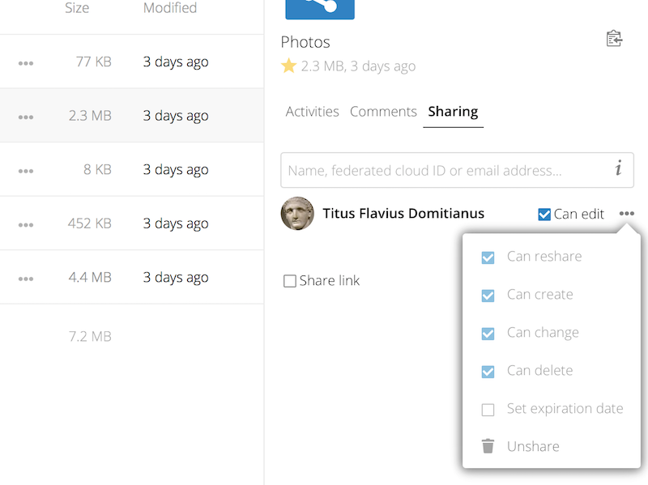

===============================================================
Acessando seus arquivos usando a interface da Web do Nextcloud
===============================================================

Você pode acessar seus arquivos do Nextcloud com a interface da
Web do Nextcloud e criar, visualizar, editar, excluir, compartilhar
e compartilhar novamente os arquivos. Seu administrador do
Nextcloud tem a opção de desativar esses recursos, portanto, se
algum deles estiver faltando no sistema, pergunte ao administrador
do servidor.

.. figure:: ../images/users-files.png
   :alt: A tela de exibição Arquivos.

Marcando arquivos
-----------------

Você pode atribuir tags aos arquivos. Para criar tags, abra um arquivo
na visualização Detalhes. Em seguida, digite suas tags. Para inserir
mais de uma tag, pressione a tecla de retorno depois de criar cada tag.
Todas as tags são tags do sistema e são compartilhadas por todos os
usuários no seu servidor Nextcloud.

.. figure:: ../images/files_page-7.png
   :alt: Criando tags de arquivo.

Em seguida, use o filtro Tags na barra lateral esquerda para filtrar arquivos por tags.

.. figure:: ../images/files_page-8.png
   :alt: Exibindo tags de arquivo.

Comentários
-----------

Use a visualização Detalhes para adicionar e ler comentários em qualquer arquivo ou pasta.
Comentários são visíveis para todos que têm acesso ao arquivo.

.. figure:: ../images/file_menu_comments_2.png
   :alt: Criando e visualizando comentários.

Video player
------------

Você pode reproduzir vídeos no Nextcloud com o aplicativo Video Player, simplesmente clicando
no arquivo. A transmissão de vídeo pelo reprodutor de vídeo nativo do Nextcloud depende do seu
navegador da Web e do formato de vídeo. Se o seu administrador do Nextcloud tiver ativado a
transmissão de vídeo e não funcionar em seu navegador da Web, pode ser um problema no navegador.
Consulte https://developer.mozilla.org/pt-BR/docs/Web/HTML Supported_media_formats
#Browser_compatibility para formatos multimídia suportados em navegadores da Web.

.. figure:: ../images/video_player_2.png
   :alt: Assistindo a um filme.

Controles de arquivos
---------------------

Nextcloud pode exibir pré-visualizações em miniatura para arquivos de imagem, capas de MP3,
e arquivos de texto, se isso for ativado pelo administrador do servidor. Passe o cursor
sobre um arquivo ou pasta para expor os controles das seguintes operações:

Favoritos
  Clique na estrela à esquerda do ícone do arquivo para marcá-lo como favorito e
  Encontre rapidamente todos os seus favoritos com o filtro Favoritos na barra lateral esquerda.

.. figure:: ../images/files_page-1.png
   :alt: Marcando arquivos favoritos.

Compartilhar
  Compartilhe o arquivo ou a pasta com um grupo ou outros usuários e crie
  compartilhamento com hiperlinks. Você também pode ver com quem já compartilhou
  e revogar compartilhamentos clicando no ícone da lixeira.

.. note:: Desde a versão 9.0, você pode ver todos os re-compartilhamentos de seus compartilhamentos de arquivos originais.

    Se o preenchimento automático do nome de usuário está habilitado, quando você
    começar a digitar o nome do usuário ou do grupo, o Nextcloud irá completá-lo
    automaticamente para você. Se o administrador ativou as notificações por e-mail,
    você pode enviar uma notificação por e-mail do novo compartilhamento na tela de compartilhamento.

Você tem cinco permissões de compartilhamento:

* Pode compartilhar; permite que os usuários com quem você compartilhar sejam compartilhados novamente.
* Pode editar; permite que os usuários com quem você compartilha edite seus arquivos compartilhados e colabore usando o aplicativo Documentos.
* Crio; permite que os usuários com os quais você compartilha crie novos arquivos e os adicione ao compartilhamento.
* Mudança; permite fazer o upload de uma nova versão de um arquivo compartilhado e substituí-lo.
* Apagar; permite que os usuários com os quais você compartilha exclua arquivos compartilhados.

Overflow Menu
  O menu Overflow (três pontos) exibe os detalhes do arquivo e permite que você
  renomear, baixar ou excluir arquivos.

.. figure:: ../images/files_page-3.png
   :alt: Menu Overflow.

   A visualização Detalhes mostra informações de Atividades, Compartilhamento e Versões.

.. figure:: ../images/files_page-4.png
   :alt: Tela Detalhes.

O ícone de engrenagem **Configurações** na parte inferior esquerda permite que você mostre ou oculte
arquivos na sua interface Web do Nextcloud. Estes também são chamados de dotfiles, porque
eles são prefixados com um ponto, por exemplo ``.mailfile``. O ponto indica ao seu operador
sistema para ocultar esses arquivos em seus navegadores de arquivos, a menos que você escolha exibir
eles. Geralmente estes são arquivos de configuração, por isso, tem a opção de ocultá-los
reduz a desordem.

.. figure:: ../images/hidden_files.png
   :alt: Ocultando ou exibindo arquivos ocultos.

Visualizando arquivos
----------------------

Você pode exibir arquivos de texto descompactados, arquivos OpenDocument, vídeos e imagens
arquivos nos visualizadores incorporados do Nextcloud clicando no nome do arquivo. Pode haver
outros tipos de arquivos que você pode visualizar se o administrador do Nextcloud tiver ativado
eles. Se o Nextcloud não puder exibir um arquivo, ele iniciará um processo de download e
transfere o arquivo para o seu computador.

Navegando dentro do seu Nextcloud
----------------------------------

Navegar pelas pastas no Nextcloud é tão simples quanto clicar em uma pasta para abri-la e
usar o botão voltar no seu navegador para passar para um nível anterior. O Nextcloud
também fornece uma barra de navegação na parte superior do campo Arquivos para navegação rápida.

Compartilhando ícones de status
--------------------------------

Qualquer pasta que tenha sido compartilhada é marcada com o ícone de sobreposição ``Shared``.
Os compartilhamentos de links públicos são marcados com um link de corrente.
Pastas não compartilhadas estão em branco.

.. figure:: ../images/files_page-5.png
   :alt: Compartilhar os ícones de status.

Criando ou fazendo upload de arquivos e diretórios
---------------------------------------------------

Carregue ou crie novos arquivos ou pastas diretamente em uma pasta Nextcloud clicando em
no botão *Novo* no aplicativo Arquivos.

.. figure:: ../images/files_page-6.png
   :alt: O menu Novo arquivo/pasta/upload.

O botão *Novo* fornece as seguintes opções:

Seta para cima
  Envie arquivos do seu computador para o Nextcloud. Você também pode enviar arquivos por
  arrastando e soltando-os do gerenciador de arquivos.

Arquivo de texto
  Cria um novo arquivo de texto e adiciona o arquivo à sua pasta atual.

Pasta
  Cria uma nova pasta na pasta atual.

Selecionando arquivos ou pastas
-------------------------------

Você pode selecionar um ou mais arquivos ou pastas clicando em suas caixas
de seleção. Para selecionar todos os arquivos no diretório atual, clique
na caixa de seleção localizada na parte superior da lista de arquivos.

Quando você seleciona múltiplos arquivos, você pode deletar todos eles,
ou baixá-los como um arquivo ZIP usando os botões ``Delete`` ou ``Download``
que aparecem no topo.

.. note:: Se o botão ``Download`` não estiver visível, o administrador
   desabilitou este recurso.

Filtrando a visualização de arquivos
------------------------------------

A barra lateral esquerda na página Arquivos contém vários filtros para
classificar e gerenciar rapidamente seus arquivos.

Todos os arquivos
  A visualização padrão; exibe todos os arquivos aos quais você tem acesso.

Favoritos
  Arquivos ou pastas marcados com a estrela amarela.

Compartilhado com você
  Exibe todos os arquivos compartilhados com você por outro usuário ou grupo.

Compartilhado com os outros
  Exibe todos os arquivos que você compartilhou com outros usuários ou grupos.

Compartilhado por link
  Exibe todos os arquivos compartilhados por você por meio de um link público.

Armazenamento Externo (opcional)
  Arquivos aos quais você tem acesso em dispositivos e serviços de armazenamento
  externo, como o Dropbox, o Google e o Amazon S3.

Movendo arquivos
----------------

Você pode mover arquivos e pastas arrastando-os e soltando-os em qualquer diretório.

Alteração na data de vencimento do compartilhamento
---------------------------------------------------

Em versões mais antigas do Nextcloud, você poderia definir uma data de expiração em ambos os locais
e ações públicas. Agora você pode definir uma data de expiração apenas em compartilhamentos públicos,
e os compartilhamentos locais não expiram quando as ações públicas expiram. A única maneira de
"expirar" um compartilhamento local é clicar no ícone da lixeira para desfazer a partilha dos seus arquivos.

Criando ou conectando-se a um link de compartilhamento de federação
--------------------------------------------------------------------

O Federated Cloud Sharing permite montar compartilhamentos de arquivos a partir do Nextcloud remoto
servidores e gerenciá-los como um compartilhamento local. Em Nextcloud 9 o processo para
criar um novo link de compartilhamento é mais fácil e simplificado. Vejo
: doc: `federated_cloud_sharing` para aprender como criar e conectar-se a novos
Compartilhamentos da nuvem federada.