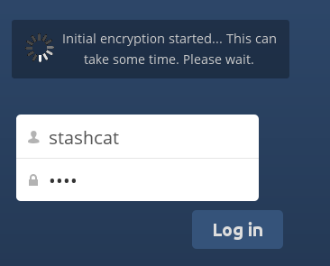

===================================================
Criptografando seus arquivos Nextcloud no servidor
===================================================

O Nextcloud inclui um aplicativo de criptografia do lado do servidor e, quando ativado por
seu administrador do Nextcloud todos os seus arquivos de dados do Nextcloud são automaticamente
criptografado no servidor.
A criptografia é em todo o servidor, portanto, quando ativada, você não pode optar por manter
arquivos não criptografados. Você não precisa fazer nada de especial, pois usa o seu
Login do Nextcloud como a senha da sua chave de criptografia privada exclusiva. Basta entrar e
sair e gerenciar e compartilhar seus arquivos como você faz normalmente, e você pode
ainda mude sua senha sempre que quiser.

Seu objetivo principal é criptografar arquivos em serviços de armazenamento remoto que são
conectado ao seu servidor Nextcloud, como o Dropbox e o Google Drive. Isto é um
maneira fácil e perfeita para proteger seus arquivos em armazenamento remoto. Você pode compartilhar
seus arquivos remotos através do Nextcloud da maneira usual, mas você não pode compartilhar
seus arquivos criptografados diretamente do Dropbox, do Google Drive ou de qualquer outro controle remoto
serviço que você está usando, porque as chaves de criptografia são armazenadas em seu servidor Nextcloud e
nunca são expostas a provedores de serviços externos.

Se o seu servidor Nextcloud não estiver conectado a nenhum serviço de armazenamento remoto,
é melhor usar alguma outra forma de criptografia, como criptografia de disco no nível de arquivo ou
inteiro. Como as chaves são mantidas no seu servidor Nextcloud, é
possível para o administrador do Nextcloud bisbilhotar seus arquivos, e se o servidor estiver
comprometido o intruso pode obter acesso aos seus arquivos. (Ler
`Criptografia em Nextcloud <https://nextcloud.com/blog/encryption-in-nextcloud/>`_
aprender mais.)

Perguntas frequentes sobre criptografia
----------------------------------------

Como a criptografia pode ser desativada?
^^^^^^^^^^^^^^^^^^^^^^^^^^^^^^^^^^^^^^^^^

A única maneira de desabilitar a criptografia é executar o `"decrypt all"
<https://docs.nextcloud.org/server/14/admin_manual/configuration_server/occ_command.html#encryption-label>`_.

.. TODO ON RELEASE: Atualize o número da versão acima no lançamento

script, que descriptografa todos os arquivos e desabilita a criptografia.

É possível desabilitar a criptografia com a chave de recuperação?
^^^^^^^^^^^^^^^^^^^^^^^^^^^^^^^^^^^^^^^^^^^^^^^^^^^^^^^^^^^^^^^^^

Sim, *se* todo usuário usar a `chave de recuperação de arquivo
<https://docs.nextcloud.com/server/14/admin_manual/configuration_files/encryption_configuration.html#enabling-users-file-recovery-keys>`_,  `"decrypt all"
<https://docs.nextcloud.org/server/14/admin_manual/configuration_server/occ_command.html#encryption-label>`_ irá usá-lo para descriptografar todos os arquivos.

.. TODO ON RELEASE: Atualize o número da versão acima no lançamento

A criptografia pode ser desativada sem a senha do usuário?
^^^^^^^^^^^^^^^^^^^^^^^^^^^^^^^^^^^^^^^^^^^^^^^^^^^^^^^^^^

Se você não tiver a senha do usuário ou a `chave de recuperação de arquivo
<https://docs.nextcloud.com/server/14/admin_manual/configuration_files/encryption_configuration.html#enabling-users-file-recovery-keys>`_.

.. TODO ON RELEASE: Atualize o número da versão acima no lançamento

então não há como descriptografar todos os arquivos.
Além do mais, executá-lo no login seria perigoso, porque
você provavelmente se depararia com timeouts.

É planejado para mover isso para o próximo login de usuário ou um trabalho em segundo plano?
^^^^^^^^^^^^^^^^^^^^^^^^^^^^^^^^^^^^^^^^^^^^^^^^^^^^^^^^^^^^^^^^^^^^^^^^^^^^^^^^^^^^^^^^^^^^

Se fizéssemos isso, precisaríamos armazenar sua senha de login no banco de dados.
Isso pode ser visto como um problema de segurança, então nada disso está planejado.

O compartilhamento de grupo é possível com a chave de recuperação?
^^^^^^^^^^^^^^^^^^^^^^^^^^^^^^^^^^^^^^^^^^^^^^^^^^^^^^^^^^^^^^^^^^

Se você quer dizer adicionar usuários a grupos e fazer isso funcionar magicamente? Não. Isso só
funciona com a chave mestra.

Usando criptografia
-------------------

Criptografia NextCloud é muito bem definida, voce pode configurar e esquecer,
mas você tem algumas opções que você pode usar.

Quando o administrador do Nextcloud permite a criptografia pela primeira vez,
você deve efetuar logout e, em seguida, efetuar login novamente para criar
suas chaves de criptografia e criptografar seus arquivos. Quando a criptografia
tiver sido habilitada no seu servidor Nextcloud, você verá um banner amarelo na
sua página de Arquivos avisando para você sair e depois fazer o login novamente.

.. figure:: ../images/encryption1.png

Quando você faz o login, leva alguns minutos para funcionar, dependendo de quantos
arquivos que você tem e, em seguida, retornará à sua página Nextcloud padrão.

.. note:: Você nunca deve perder sua senha do Nextcloud, porque você perderá
   acesso aos seus arquivos. Embora exista uma opção de recuperação opcional que o seu
   O administrador do Nextcloud pode ativar; veja a seção Senha da chave de recuperação
   (abaixo) para aprender sobre isso.

Compartilhando arquivos criptografados
--------------------------------------

Somente usuários que possuem chaves de criptografia privadas têm acesso a
arquivos e pastas criptografados compartilhados. Os usuários que ainda não
criaram suas chaves de criptografia privadas não terão acesso a arquivos
compartilhados criptografados; eles verão pastas e nomes de arquivos, mas
não poderão abrir ou baixar os arquivos. Eles verão um banner de aviso
amarelo que diz "O aplicativo de criptografia está habilitado, mas suas
chaves não estão inicializadas, faça o logout e faça o login novamente."

Os proprietários de compartilhamentos podem precisar compartilhar
novamente os arquivos depois que a criptografia estiver ativada; os
usuários que tentam acessar o compartilhamento verão uma mensagem
avisando-os para solicitar ao proprietário do compartilhamento que
compartilhe novamente o arquivo com eles. Para compartilhamentos
individuais, descompartilhe e compartilhe novamente o arquivo. Para
compartilhamentos de grupo, compartilhe com qualquer pessoa que não
possa acessar o compartilhamento. Isso atualiza a criptografia e, em
seguida, o proprietário do compartilhamento pode remover os
compartilhamentos individuais.

Senha da chave de recuperação
^^^^^^^^^^^^^^^^^^^^^^^^^^^^^

Se o seu administrador do Nextcloud tiver ativado o recurso de chave
de recuperação, você poderá optar por usar esse recurso para sua
conta. Se você ativar "Recuperação de senha", o administrador poderá
ler seus dados com uma senha especial. Esse recurso permite que o
administrador recupere seus arquivos caso você perca sua senha do
Nextcloud. Se a chave de recuperação não estiver ativada, não será
possível restaurar seus arquivos se você perder sua senha de login.

.. figure:: ../images/encryption3.png

Arquivos não criptografados
----------------------------

Somente os dados em seus arquivos são criptografados e não os nomes de arquivos ou pastas
estruturas. Esses arquivos nunca são criptografados:

- Arquivos antigos na lixeira.
- Miniaturas de imagem do aplicativo Gallery.
- Pré-visualizações do aplicativo Arquivos.
- O índice de pesquisa do aplicativo de pesquisa de texto completo.
- dados de aplicativos de terceiros

Pode haver outros arquivos que não são criptografados;
Somente os arquivos que são expostos a provedores de
armazenamento de terceiros têm a garantia de serem criptografados

Alterar senha da chave privada
^^^^^^^^^^^^^^^^^^^^^^^^^^^^^^

Esta opção só estará disponível se sua senha de login, mas não sua
senha de criptografia, tiver sido alterada pelo seu administrador.
Isso pode ocorrer se seu provedor do Nextcloud usar um backend de
usuário externo (por exemplo, LDAP) e tiver alterado sua senha de
login usando essa configuração de backend. Nesse caso, você pode
definir sua senha de criptografia para sua nova senha de login,
fornecendo sua antiga e nova senha de login. O aplicativo de
criptografia funciona somente se sua senha de login e sua senha
de criptografia forem idênticas.
