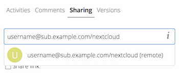

======================================
Usando compartilhamentos de federação
======================================

O Compartilhamento de Federação permite montar compartilhamentos de arquivos dos
servidores Nextcloud remotos, criando, na verdade, sua própria nuvem de 
Nextclouds. Você pode criar links de compartilhamento direto com usuários em 
outros servidores Nextcloud.

Criando um novo compartilhamento de federação
----------------------------------------------

O compartilhamento de federação está ativado em instalações novas ou atualizadas
do Nextcloud por padrão. Siga estas etapas para criar um novo compartilhamento 
com outros servidores Nextcloud ou ownCloud 9+:

1. Vá para a sua página ``Files`` e clique no ícone de Compartilahemnto no 
arquivo ou diretório que você quer compartilhar. Na barra lateral, digite o nome
de usuário e o URL do usuário remoto desta forma:``<username>@<oc-server-url>``.
Neste exemplo, isso é ``layla@remote-server/nextcloud``. O formulário mostra 
automaticamente o endereço que você digita e rotula como "remoto". 
Clique no rótulo.

2. Quando o seu servidor Nextcloud local faz uma conexão bem-sucedida com o 
servidor Nextcloud remoto, você verá uma confirmação. Sua única opção de 
compartilhamento é **Permissao de editar**.

Clique no botão Compartilhar a qualquer momento para ver com quem você 
compartilhou seu arquivo. Remover seu compartilhamento vinculado a qualquer 
momento, clicando no ícone da lixeira. Isso apenas desvincula compartilhar e não
exclui nenhum arquivo.

Criando um novo Federated Cloud Share por email
------------------------------------------------

Use este método quando estiver compartilhando com usuários no ownCloud 8.x e 
mais antigo.

E se você não souber o nome de usuário ou a URL? Então você pode ter o Nextcloud
para criar o link para você e enviá-lo por e-mail ao seu destinatário.

.. figure:: ../images/create_public_share-6.png

Quando seu destinatário receber seu e-mail, ele precisará executar várias etapas
para concluir o link de compartilhamento. Primeiro, eles devem abrir o link que 
você enviou em um navegador da Web e, em seguida, clicar no botão 
**Adicionar ao seu Nextcloud**.

.. figure:: ../images/create_public_share-8.png

O botão **Adicionar ao seu Nextcloud** muda para um campo de formulário, e o 
destinatário precisa inserir a URL do servidor Nextcloud ou ownCloud nesse campo
e pressionar a tecla de retorno ou clicar na seta.

.. figure:: ../images/create_public_share-9.png

Em seguida, eles verão uma caixa de diálogo pedindo para confirmar. Tudo o que 
eles precisam fazer é clicar no botão **Adicionar compartilhamento remoto** e 
estão Federados!.

Remova o seu compartilhamento vinculado a qualquer momento clicando no ícone da 
lixeira. Isso só desassocia o compartilhamento e não exclui nenhum arquivo.
