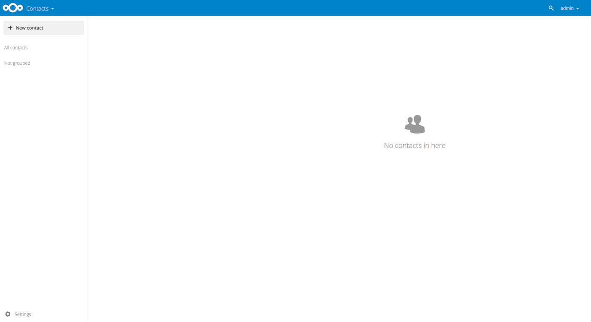

=================================
Usando o aplicativo de contatos
=================================

O aplicativo Contatos não está ativado por padrão em Nextcloud | version | e precisa
ser instalado separadamente da nossa App Store.

O aplicativo Contatos Nextcloud é semelhante a outros aplicativos de contato móvel, porem
com mais funcionalidade. Quando você acessa pela primeira vez o aplicativo Contatos, um padrão
O livro de endereços fica disponível.

  **Aplicativo de contatos (vazio)**

Adicionando contatos
---------------------

Você pode adicionar contatos usando um dos seguintes métodos:

* Importar contatos usando um arquivo de arquivo de contato virtual (VCF / Vcard)

* Adicionar contatos manualmente

Importando Contatos
~~~~~~~~~~~~~~~~~~~

A maneira mais rápida de adicionar contatos é através do uso de um arquivo de contato virtual
(VCF / Vcard).

Para importar contatos usando um arquivo VCF / Vcard:

1. Na parte inferior do campo Informações do aplicativo Contatos, localize o botão de engrenagem.

  .. figure:: ../images/contact_bottombar.png

  **Botão de engrenagem das configurações de contato**

2. Clique no botão de engrenagem. O campo de upload do aplicativo Contatos é aberto.

.. figure:: ../images/contact_uploadbutton.png

**Campo de upload do aplicativo de contatos**

.. note:: O aplicativo Contatos suporta apenas a importação de vCards versão 3.0 e 4.0.

Criando contatos manualmente
~~~~~~~~~~~~~~~~~~~~~~~~~~~~

O aplicativo Contatos permite que você crie contatos manualmente.

Para criar um novo contato:

1. Clique no botão ``+ Novo contato``.

   Uma nova configuração de contato vazia é aberta no campo Application View.

  .. figure:: ../images/contact_new.png

2. 2. Especifique as novas informações de contato. As alterações são feitas imediatamente.

Editar ou remover informações de contato
~~~~~~~~~~~~~~~~~~~~~~~~~~~~~~~~~~~~~~~~

O aplicativo Contatos permite editar ou remover informações de contato.

Para editar ou remover informações de contato:

1. Navegue até o contato específico que você deseja modificar.

2. Selecione as informações no campo que você deseja editar ou remover.

3. Faça suas modificações ou clique na lixeira.

Mudanças ou remoções são feitas imediatamente.

Imagem de contato
~~~~~~~~~~~~~~~~~

Para definir uma foto de contato, clique no botão de upload:

.. figure:: ../images/contact_picture.png

    **Imagem de contato (botão de upload)**

Depois de ter uma foto de contato, será semelhante a:

.. figure:: ../images/contact_picture_set.png

  **Imagem de contato (definida)**

Se você quiser fazer o upload de um novo, remova-o, visualize-o no tamanho original ou baixe-o
clique na foto dos contatos.

.. figure:: ../images/contact_picture_options.png

Adicionando e gerenciando catálogos de endereços
-------------------------------------------------

Clicando no botão de configurações (engrenagem) na parte inferior das informações do aplicativo
campo fornece acesso às configurações do aplicativo Contato. Este campo mostra todos
livros de endereços disponíveis e permite-lhe
para criar novos catálogos de endereços, simplesmente especificando um nome de catálogo de endereços.

.. figure:: ../images/contact_manageaddressbook.png

   **Adicione o catálogo de endereços nas configurações de contatos**

As Configurações de Contatos também permitem compartilhar, exportar e excluir catálogos
de endereços. Então você quer encontrar os URLs CardDAV lá.
Veja :doc:`index` para mais detalhes sobre como sincronizar seus livros de endereços
com iOS, macOS, Thunderbird e outros clientes CardDAV.
