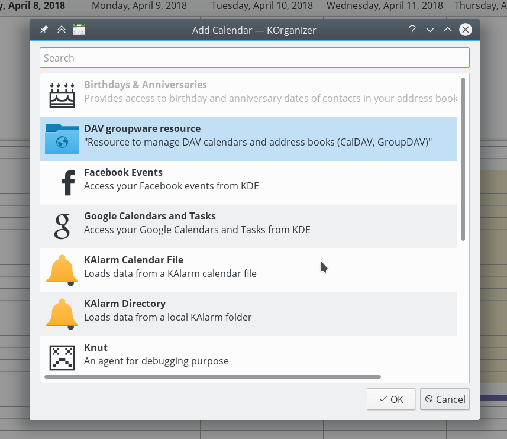

===================================
Sincronizando com o Kontact do KDE
===================================

O KOrganizer e o KAddressBook podem sincronizar seu calendário, contatos e tarefas com um servidor Nextcloud.

Isso pode ser feito seguindo estas etapas:

1. Abra o KOrganizer e na lista de calendários (canto inferior esquerdo) clique com o botão direito e escolha ``Add Calendar``.

.. image:: ../images/KOrganizer_add_calendar.png

2. Na lista de recursos resultante, escolha ``DAV groupware resource``.

3. Digite seu nome de usuário. Como senha, você precisa gerar um app-password/token (`Aprenda mais <https://docs.nextcloud.com/server/stable/user_manual/session_management.html#managing-devices>` _).

.. image:: ../images/korganizer_credentials.png

4. Escolha ``ownCloud`` ou ``Nextcloud`` como opção do servidor Groupware.

.. image:: ../images/KOrganizer_groupware_server.png

5. Insira sua URL do servidor Nextcloud e, se necessário, o caminho da instalação (qualquer coisa que venha depois da primeira /, por exemplo, ``mynextcloud`` em ``https://exampe.com/mynextcloud``). Então clique em próximo.

.. image:: ../images/KOrganizer_server_address.png

6. Agora você pode testar a conexão, o que pode levar algum tempo para a conexão inicial. Se isso não funcionar, você pode voltar e tentar corrigi-lo com outras configurações.

.. image:: ../images/KOrganizer_test1.png

.. image:: ../images/KOrganizer_test2.png

7. Escolha um nome para este recurso, por exemplo, ``Work`` ou ``Home``. Por padrão, tanto o CalDAV (Calendar) quanto o CardDAV (Contacts) são sincronizados.

.. note:: Você pode definir uma taxa de atualização manual de quatro seus recursos de agenda e contatos. Por padrão, essa configuração é definida para 5 minutos e deve ser adequada para a maioria dos casos de uso. Você pode querer mudar isso para salvar seu poder ou plano de dados de celular. que você pode atualizar clicando com o botão direito do mouse no item da lista de calendários e, quando você cria um novo compromisso, ele é sincronizado com o Nextcloud imediatamente.

.. image:: ../images/KOrganizer_pick_resources.png

8. Após alguns segundos ou minutos, dependendo da sua conexão com a Internet, você encontrará seus calendários e contatos dentro dos aplicativos do KDE Kontact, KOrganizer e KAddressBook!

.. image:: ../images/KOrganizer.png
.. image:: ../images/KAddressBook.png
