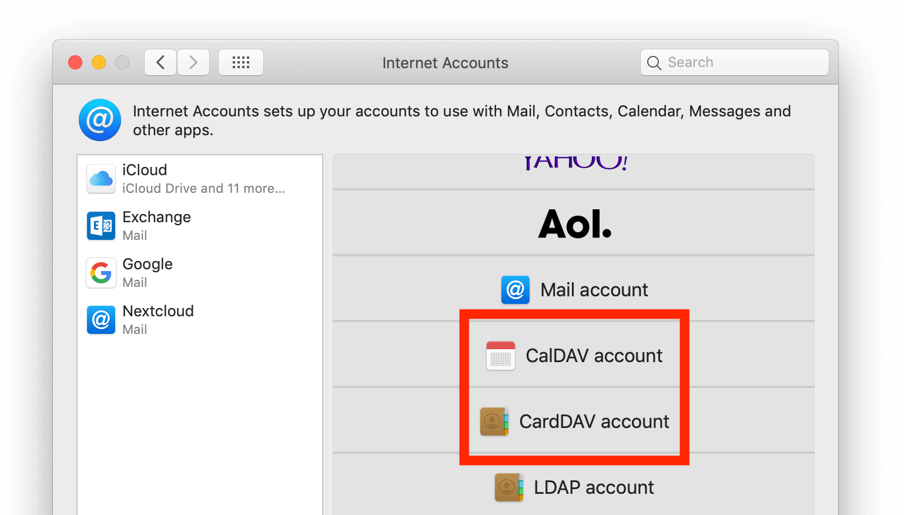

=========================
Sincronizando com o macOS
=========================

Configure suas contas
---------------------

Nas etapas a seguir, você adicionará seus recursos de servidor para **CalDAV** (Calendário)
e **CardDAV** (Contatos) para o seu Nextcloud.

1. Abra as **preferências do sistema** do seu dispositivo macOS

2. Navegue para **Contas da Internet**

.. figure:: ./images/macos_1.png

3. Clique em **Adicionar outra conta...** e clique em **Conta CalDAV** para o Google Agenda
   ou **Conta CardDAV** para Contatos.

.. note:: Você não pode configurar o Calendário / Contatos juntos. Você precisa configurá-los
          em **contas separadas**.

4. Selecione **Avançado** como tipo de conta e digite suas respectivas credenciais:

   **Username**: Seu nome de usuário ou e-mail do Nextcloud
   **Password**: Sua senha do aplicativo gerado / símbolo (`App-password/token <https://docs.nextcloud.com/server/stable/user_manual/session_management.html#managing-devices>`_)
   **Server Address**: URL do seu servidor Nextcloud (por exemplo https://cloud.example.com)
   **Server Path:** /remote.php/dav/principals/users/[your_username]
   **Port:** 443
   **Use SSL:** Yes

5. Clique em **Entrar**.

**Para CalDAV (Calendário):** Agora você pode selecionar qual aplicativo você
deseja usar este recurso. Na maioria dos casos, esse será o aplicativo "Calendário".
Às vezes, você pode querer usá-lo para suas **Tarefas e lembretes**.

.. figure:: ./images/macos_4.png

Solução de problemas
---------------------

- O macOS **não** suporta a sincronização de CalDAV / CardDAV em conexões não criptografadas **http: //**.
Certifique-se de ter https:// ativado e configurado no servidor e no lado do cliente.

- **Certificados autoassinados** precisam ser configurados corretamente no keychain do macOS.