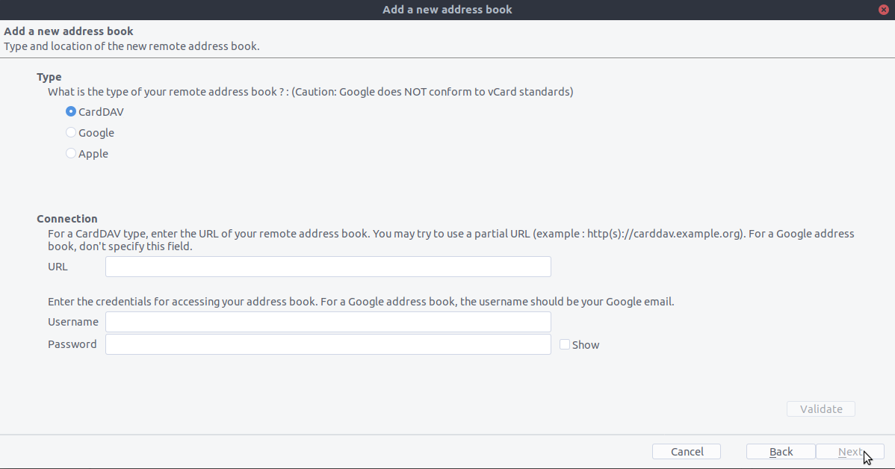
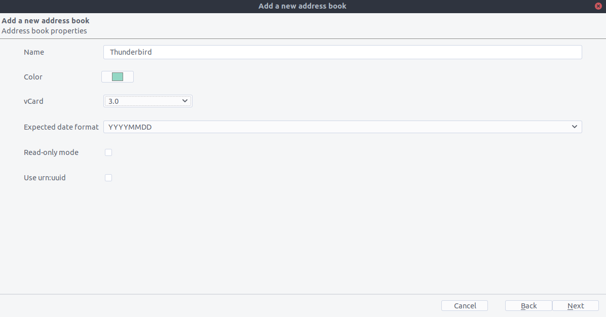

================================
Sincronizando com o Thunderbird
================================

Contatos
--------

Como alguém que é novo no Nextcloud e novo no CardBook este é o trabalho duro que você precisa fazer:

- `Thunderbird <https://www.thunderbird.net/>`_ para o seu sistema operacional, a menos que ele venha com a distribuição do sistema operacional (Linux)
- `CardBook <https://addons.thunderbird.net/en-US/thunderbird/addon/cardbook/>`_ (um complemento de contatos do Thunderbird.)

Depois de instalar o CardBook e o Thunderbird, faça o seguinte:

1. No canto inferior esquerdo da Visualização de Contatos (em Nextcloud contatcs) procure por um pequeno símbolo de impulsor semelhante a este:

.. image:: ../images/contacts_link.png

que mostrará algo assim:
https://cloud.nextcloud.com/remote.php/dav/addressbooks/users/daniel/Thunderbird/

2. O Cardbook é encontrado no canto superior direito do Thunderbird:

.. image:: ../images/cardbook_icon.png

3. No complemento do Thunderbird Cardbook:

   -  "Adressbook > New Adressbook **Remote** > Next
   - Preencha suas informações

4. Valide suas configurações, clique em Avançar, escolha o nome do bloco de endereços e clique em Avançar novamente.

5. Uma vez instalado, sincronize seu livro de endereços clicando em "Sincronizar" no canto superior esquerdo do CardBook.
Você verá sua lista de endereços preencher a partir do Nextcloud!

.. image:: ../images/synchronize_cardbook.png

O resto dos detalhes de lidar com o Thunderbird CardBook são deixados para o leitor ...

Calendário
----------

- `Thunderbird <https://www.thunderbird.net/>`_ para o seu sistema operacional, a menos que ele venha com a distribuição do sistema operacional (Linux)
- `Lightning <https://addons.mozilla.org/en-US/thunderbird/addon/lightning/>`_ (um complemento do calendário do Thunderbird.)

Depois de instalar o Lighning e o Thunderbird, faça o seguinte:

1. Vá para o seu Calendário Nextcloud e clique no menu de 3 pontos para o calendário que você deseja sincronizar, que será exibido assim:
https://cloud.nextcloud.com/remote.php/dav/calendars/daniel/personal/

2. Vá para a visualização de calendário no Thunderbird e clique com o botão direito do mouse no calendário à esquerda (onde estão os nomes dos calendários) para adicionar um **Novo Calendário**.

3. Escolha **On the network**

.. image:: ../images/new_calendar.png

4. Escolha **CalDAV** e preencha as informações que faltam:

.. image:: ../images/CalDAV_calendar.png

O resto do calendário do Thunderbird é deixado para o leitor ...
