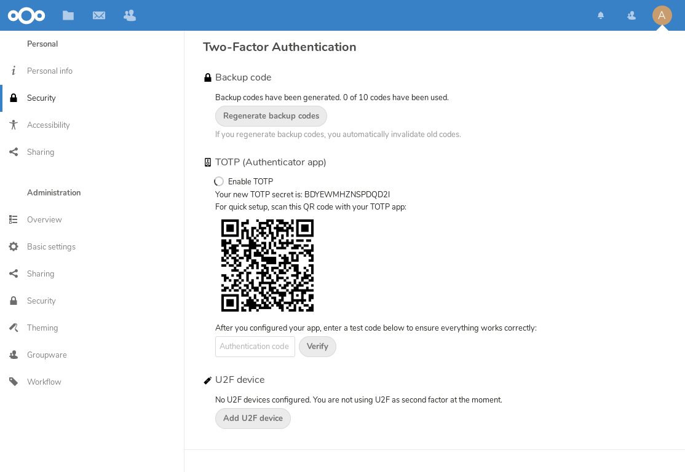
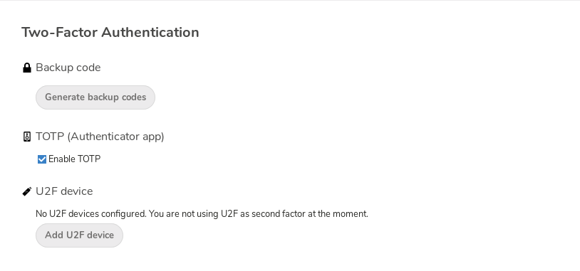
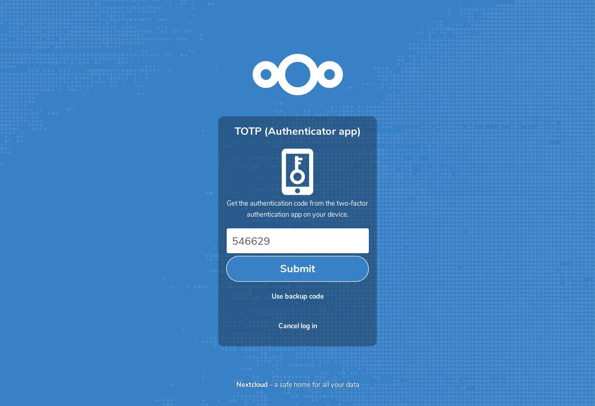

===================================
Usando autenticação de dois fatores
===================================

A autenticação de dois fatores (2FA) é uma maneira de proteger sua conta do
Nextcloud contra acesso não autorizado. Funciona exigindo duas 'provas' 
diferentes da sua identidade. Por exemplo, *algo que você sabe* (como uma senha)
and e *algo que você tem* como uma chave física. Normalmente, o primeiro fator é
uma senha como você já tem e o segundo pode ser uma mensagem de texto que você 
recebe ou um código que você gera em seu telefone ou outro dispositivo 
(*algo que você tem*). O Nextcloud suporta uma variedade de 2º fatores e
outros podem ser adicionados.

Depois que um aplicativo de autenticação de dois fatores for habilitado pelo 
seu administrador você poderá ativá-lo e configurá-lo em :doc:`userpreferences`. 
Abaixo você pode ver como.

Configurando a autenticação de dois fatores
-------------------------------------------

Em suas configurações pessoais, procure a configuração de segundo fator de 
autenticação. Neste exemplo, este é o TOTP, um código baseado no tempo 
compatível com o Google Authenticator.

Você verá seu segredo e um código QR que pode ser verificado pelo aplicativo 
TOTP em seu telefone (ou outro dispositivo). Dependendo do aplicativo ou 
ferramenta, digite o código ou digitalize o QR e seu dispositivo mostrará um 
código de login que muda a cada 30 segundos.

Códigos de recuperação no caso de você perder seu segundo fator
---------------------------------------------------------------

Você deve sempre gerar códigos de backup para 2FA. Se o seu dispositivo de 
2º fator for roubado ou não estiver funcionando, você poderá usar um desses 
códigos para desbloquear sua conta. Funciona efetivamente. como um segundo 
fator de backup. Para obter os códigos de backup, acesse as configurações 
pessoais e procure em Configurações de autenticação de segundo fator. 
Escolha *Gerar códigos de backup*.

Você será apresentado a uma lista de códigos de backup de uso único.
     
.. figure:: images/2fa_backupcode_2.png
     :alt: Códigos de backup 2FA

Você deve colocar esses códigos em um local seguro, em algum lugar onde possa 
encontrá-los. Não os coloque junto com seu segundo fator como o seu celular, 
mas certifique-se de que, se você perder um, ainda terá o outro. Mantê-los em 
casa é provavelmente a melhor coisa a fazer.

Efetuando login com autenticação de dois fatores
------------------------------------------------

Depois de sair e precisar fazer login novamente, você verá uma solicitação para 
inserir o código TOTP no seu navegador. Se você ativar não apenas o fator TOTP, 
mas outro, você verá uma tela de seleção na qual você pode escolher o método de 
dois fatores para este login. Selecione TOTP.

.. figure:: images/totp_login_1.png
     :alt: Escolhendo um método de autenticação de dois fatores.

Agora, basta digitar seu código:

Se o código estiver certo, você será redirecionado para sua conta do Nextcloud.

.. note:: Como o código é baseado em tempo, é importante que o relógio do seu
  servidor e do smartphone esteja quase sincronizado. Um desvio de tempo de
  alguns segundos não será um problema.

Usando aplicativos clientes com autenticação de dois fatores
------------------------------------------------------------

Depois de ativar o 2FA, seus clientes não poderão mais se conectar apenas com 
sua senha, a menos que também tenham suporte para autenticação de dois fatores. 
Para resolver isso, você deve gerar senhas específicas do dispositivo para elas.
Veja :doc:`session_management` para mais informações sobre como fazer isso. 

